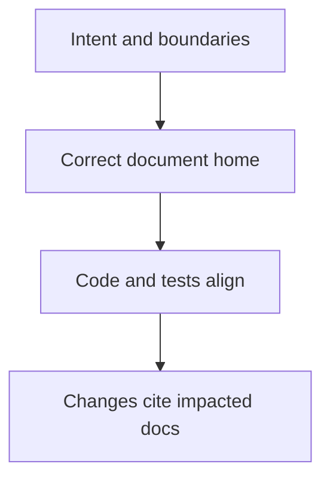

# Documentation Guide

## Purpose

Define documentation writing standards, placement boundaries, and governance rules so documentation remains authoritative, teachable, and durable.

Documentation defines shared understanding and architectural intent. It is not optional commentary.

---

## Core Idea

Documentation establishes:

- what the system is
- why it is shaped this way
- where boundaries exist

It is the reference point for review and decision-making.

---

## Illustration

This flow illustrates how documentation moves from intent to enforcement.

---

## 1) Writing Style

- Write for humans.
- Be direct and grounded.
- Prefer clarity over cleverness.
- Avoid abstraction when concrete language is available.
- Adjust tone to the purpose of the document.

---

## 2) Documentation Modes

Different documents serve different purposes. They must not be written in the same style.

### Experience Documents

Examples: `USER_EXPERIENCE.md`

Purpose:
- Describe how the system feels to use.
- Define tone, flow, and interaction qualities.

Style:
- Narrative and human-centered.
- Focus on presence, continuity, and simplicity.
- Avoid technical and internal system language.

---

### Architectural and Functional Documents

Examples: `ARCHITECTURE.md`

Purpose:
- Define structure, behavior, and constraints.
- Ensure correctness and buildability.

Style:
- Precise and explicit.
- Use strict boundary language: must, must not, prohibited.

---

### Rule

Each document must follow its mode. Mixing styles is prohibited.

---

## 3) Didactic Structure

- Start with the main idea and orientation.
- Move from high-level framing to detail.
- Use diagrams when they improve understanding.

Every major concept must answer:

- What is this?
- Why is it this way?
- What are we avoiding?

---

## 4) Mental Model

- Document both what is true and why it is true.
- Preserve durable concepts over implementation detail.

---

## 5) Boundary Language

Use strict language for constraints:

- must
- must not
- prohibited

---

## 6) Knowledge Placement

| Knowledge Type | Canonical Home |
|---|---|
| Commands and setup | README.md |
| Non-negotiable boundaries and invariants | ARCHITECTURE.md |
| Compressed shared mental models | CORE_CONCEPTS.md |
| Long-lived intent and direction | FOUNDATIONS.md |
| End-to-end system explanation | SYSTEM_OVERVIEW.md |
| Development wiring semantics and rationale | DEVELOPMENT_MODEL.md |
| System-wide decisions and their rationale | ARCHITECTURAL_DECISIONS.md |
| Testing intent and enforcement model | TESTING_STRATEGY.md |
| Local behavior, invariants, and module-level decisions | Code artifact docs (class headers, module comments, inline notes) |

Current repository status notes:

- `README.md` exists and is the command/setup entry point.
- `ARCHITECTURE.md` exists and is the canonical home for boundaries/invariants.
- `ARCHITECTURAL_DECISIONS.md` exists and is the canonical home for system-wide decisions.
- `TESTING_STRATEGY.md` exists and is the canonical home for testing intent.
- `CORE_CONCEPTS.md`, `FOUNDATIONS.md`, `SYSTEM_OVERVIEW.md`, and `DEVELOPMENT_MODEL.md` are optional future docs in this repository and must not be referenced as required unless they are created.

---

## 7) Code vs Docs vs Tests

- Code implements behavior and local invariants.
- Tests verify behavior and enforce boundaries.
- `docs/` files define system shape, system-wide intent, and app-wide constraints.
- Code artifact docs carry the memory layer for each module: the why, the invariants, the rationale, and the decisions that shaped the local implementation.

---

## 8) Code Artifact Documentation

Code artifacts carry a documentation layer that is distinct from the code itself.

The code tells what is done. The documentation in the artifact tells why — the invariants, rationale, learnings, and local decisions that shaped the implementation. This layer is institutional memory. It must not be lost when code is refactored.

### What belongs in code artifact docs

- Why the module is shaped the way it is.
- Invariants the module enforces and what breaks if they are violated.
- Decisions that were made locally and why alternatives were rejected.
- Assumptions the code depends on.
- Learnings discovered during implementation.

### What does not belong in code artifact docs

- System-wide decisions: those belong in `ARCHITECTURAL_DECISIONS.md`.
- App-wide invariants: those belong in `ARCHITECTURE.md`.
- Anything that applies beyond the scope of this module.

### Writing Standard

Code artifact documentation is written for humans. It follows the same didactic quality standard as `docs/` files:

- Structured and readable.
- Explicit about design intent.
- Oriented from the main idea toward detail.
- Captures not only current state but also why it is this way.

### Maintenance

When a module is changed, its documentation must be reviewed. Inconsistencies, stale rationale, and superseded knowledge are documentation defects. They must be surfaced and rectified — not silently ignored or left alongside the new implementation. An artifact that contradicts itself is harder to reason about than one with no documentation at all.

---

## 9) Authority and Governance

- Documentation must be consulted before architectural changes.
- Code that contradicts documented invariants is incorrect unless docs are updated.
- Changes must cite impacted documents.
- Boundary changes must update docs and tests together.

---

## 10) Language Principles

Prefer concrete statements:

- "You build once and refresh."
- "No sync step is needed."

---

## 11) Anti-Patterns

- Repeating the same concept across documents.
- Mixing conceptual explanation with commands.
- Writing documentation as code commentary.
- Using one detail level for everything.
- Mixing experience tone with architectural or operational content.
- Embedding local implementation detail (function names, file paths, class names) in high-level docs — that belongs in code artifact headers.

---

## 12) Non-Goals

- The system must not claim reverse tunnel listener behavior that is not implemented in code.
- The system must not introduce broad abstractions or infrastructure that are not required by the current slice.
- The system must not add speculative architecture disconnected from the implemented `Connection` facade and current docs.

---

## 13) Drift Prevention Checklist

Use this checklist when a document is reviewed or updated to prevent documentation from diverging from the system.

**Before making changes:**

- [ ] Identify which documents are affected by the change.
- [ ] Confirm the document to be updated matches its declared mode (experience / architectural / administrative).

**While writing:**

- [ ] Each concept is placed in its canonical home (see Knowledge Placement table above).
- [ ] No local implementation detail (function names, file paths, specific class names) appears in high-level documents — that detail lives in code artifact headers.
- [ ] Boundary language (`must`, `must not`, `prohibited`) is used consistently for constraints.
- [ ] Every major section answers: what is this, why is it this way, what are we avoiding.

**After writing:**

- [ ] Cross-links between related documents are accurate and complete.
- [ ] No concept is defined in two documents without one being a clear canonical home and the other a pointer.
- [ ] If an architectural decision was involved, it is recorded in `ARCHITECTURAL_DECISIONS.md`.
- [ ] If an invariant changed, `ARCHITECTURE.md` is updated.
- [ ] Tests that enforce the changed boundary or invariant are updated alongside the docs.

---

## Implications

- Contributors know where and how to write.
- Reviews can enforce clarity and boundaries.
- Drift becomes visible and correctable.
