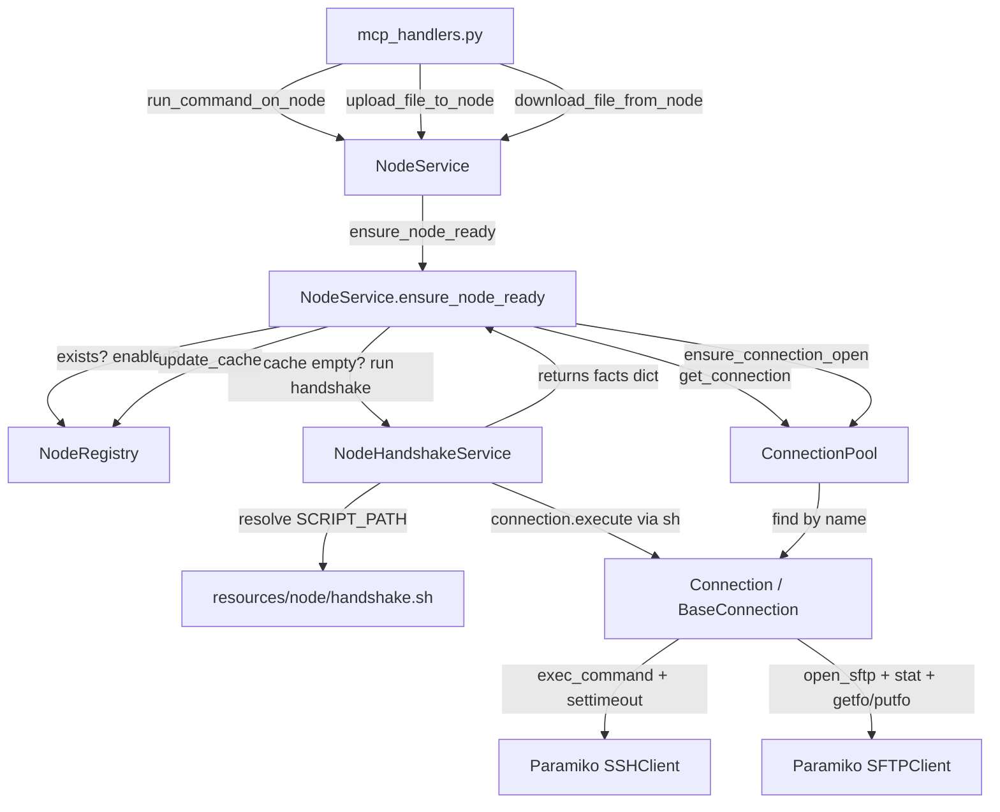

# Node Execution and Handshake API Slice — Architecture Plan (Final)

## Goal

Add node-scoped command execution and file transfer to the MCP API surface, and add a minimal post-connect handshake that populates `NodeInfoCache` with basic OS/node facts.

## Final API Surface After This Slice

```
get_node_status          ← existing
get_node_info            ← existing (gains real data via handshake)
get_agent_public_key     ← existing
add_node                 ← existing
remove_node              ← existing
enable_node              ← existing
disable_node             ← existing
run_command_on_node      ← NEW
upload_file_to_node      ← NEW
download_file_from_node  ← NEW
```

Existing `run_command` and `upload_file` remain unchanged as legacy/local tools.

---

## Phased Implementation Plan

```
Phase 1 — resources/node/handshake.sh
Phase 2 — NodeHandshakeService + parser unit tests
Phase 3 — pool open/get connection seam (get_connection + ensure_connection_open)
Phase 4 — NodeService execution readiness path (ensure_node_ready)
Phase 5 — run_command_on_node (with timeout)
Phase 6 — upload_file_to_node / download_file_from_node
Phase 7 — MCP registration + handler tests
Phase 8 — functional tests using isolated sshd fixture
Phase 9 — docs and live MCP validation
```

---

## Layer Responsibility Summary

```
resources/node/handshake.sh  — visible, reviewable, manually runnable node-side script
NodeHandshakeService         — loads script, runs it over SSH via sh, parses output, returns facts
NodeService                  — owns node guards + readiness path + calls handshake as needed
ConnectionPool               — transport lifecycle: open, close, reconnect, expose connections
Connection / BaseConnection  — SSH exec, SFTP transfer — no node semantics
NodeInfoCache / NodeRegistry — stores handshake facts
mcp_handlers.py              — delegates only, no logic
```

**Connection is transport mechanics. Handshake is node semantics.**

---

## Architecture Diagram



---

## Phase 1 — `resources/node/handshake.sh`

**New file:** [`resources/node/handshake.sh`](resources/node/handshake.sh)

POSIX `sh` compatible. No `bash`. No `jq`. No non-standard tools. Uses `printf` for predictable output. Nested quote-safe.

```sh
#!/bin/sh
# Node handshake — minimal facts for NodeInfoCache.
# POSIX sh compatible. No jq. No non-standard tools.
# Output: key=value pairs, one per line using printf.
# Values may contain spaces and = signs; parser splits on first = only.

printf 'hostname=%s\n'       "$(hostname 2>/dev/null || printf '')"
printf 'kernel_name=%s\n'    "$(uname -s 2>/dev/null || printf '')"
printf 'kernel_release=%s\n' "$(uname -r 2>/dev/null || printf '')"
printf 'architecture=%s\n'   "$(uname -m 2>/dev/null || printf '')"
printf 'current_user=%s\n'   "$(whoami 2>/dev/null || printf '')"
printf 'shell=%s\n'          "${SHELL:-}"

os_pretty_name=""
if [ -r /etc/os-release ]; then
    . /etc/os-release
    os_pretty_name="${PRETTY_NAME:-}"
fi
if [ -z "$os_pretty_name" ]; then
    os_pretty_name="$(uname -s 2>/dev/null || printf '')"
fi
printf 'os_pretty_name=%s\n' "$os_pretty_name"

printf 'collected_at=%s\n'   "$(date -u +%Y-%m-%dT%H:%M:%SZ 2>/dev/null || printf '')"
```

**Execution on node:** `sh -s < resources/node/handshake.sh` (no `bash` dependency)

**Why a file, not inline Python strings:**
- Visible, reviewable, diffable as a first-class artifact
- Runnable manually during troubleshooting: `ssh node 'sh -s' < resources/node/handshake.sh`
- Independently testable
- Not buried inside Python orchestration logic

---

## Phase 2 — `NodeHandshakeService`

**New file:** [`agent/nodes/handshake.py`](agent/nodes/handshake.py)

### Constructor

```python
class NodeHandshakeService:
    def __init__(self, resource_root: Path | None = None) -> None:
        """
        Args:
            resource_root: Base path for resolving resources/node/handshake.sh.
                           Defaults to the project root (parent of agent/).
                           Injectable for tests: pass a temp directory containing
                           a resources/node/handshake.sh for isolation.
        """
        self._resource_root = resource_root or Path(__file__).parent.parent
        self._script_path = self._resource_root / "resources" / "node" / "handshake.sh"
```

Resolving relative to `Path(__file__).parent.parent` (i.e., the package root) makes the script location process-working-directory-independent and stable regardless of where `python` is invoked from.

### `run(connection) -> dict`

```python
def run(self, connection, timeout: int = 10) -> dict:
    """
    Load handshake.sh, execute it on the node via sh, parse key=value output.

    Args:
        connection: An open Connection/BaseConnection instance with execute().
        timeout:    Max seconds to wait for the handshake script. Default 10.

    Returns:
        dict of {fact_name: {"value": str, "source": "handshake", "collected_at": str}}
        On failure: {} — never raises, logs warning instead.
    """
```

**Implementation:**
1. Load script text from `self._script_path`; if `FileNotFoundError`, log and return `{}`
2. Execute: `connection.execute("sh -s <<'EOF'\n" + script + "\nEOF", timeout=timeout)`
3. Parse stdout: for each line, split on **first** `=` only — everything after the first `=` is the value
4. Skip lines that do not contain `=`; log a warning per skipped line
5. Extract `collected_at` from parsed facts; use it as the `collected_at` field for all entries
6. Wrap each value: `{"value": stripped_value, "source": "handshake", "collected_at": collected_at}`
7. Return the facts dict; partial results are valid

**Parser contract — first `=` split:**

```
"hostname=my-host"           → key="hostname",        value="my-host"
"os_pretty_name=Ubuntu 24.04 LTS" → key="os_pretty_name", value="Ubuntu 24.04 LTS"
"some_key=a=b=c"             → key="some_key",        value="a=b=c"
"collected_at=2026-01-01T00:00:00Z" → key="collected_at", value="2026-01-01T00:00:00Z"
```

### Unit tests — `tests/agent/nodes/test_handshake_service.py` *(new)*

| Test | What it verifies |
|---|---|
| `test_script_file_exists` | `resources/node/handshake.sh` is present relative to project root |
| `test_script_starts_with_sh_shebang` | First line is `#!/bin/sh` |
| `test_script_is_readable` | File has non-zero content |
| `test_parse_well_formed_output` | Full output round-trips all expected keys correctly |
| `test_parse_value_with_equals_signs` | `some_key=a=b=c` produces value `"a=b=c"` |
| `test_parse_partial_output` | Missing keys produce no entries, no exception |
| `test_parse_empty_output` | Empty stdout returns `{}`, no exception |
| `test_run_returns_facts_dict_shape` | With mock connection returning canned stdout, verifies structure of each fact entry |
| `test_resource_root_injection` | `NodeHandshakeService(resource_root=tmp_path)` loads script from injected root |
| `test_missing_script_returns_empty_dict` | If script path does not exist, returns `{}` without raising |

---

## Phase 3 — Pool Connection Seam

**File:** [`agent/connectionpool/pool.py`](agent/connectionpool/pool.py)

### New: `get_connection(name: str) -> Optional[Connection]`

```python
def get_connection(self, name: str) -> Optional[Connection]:
    """Thread-safe lookup by name. Returns Connection or None if not in pool."""
    with self.lock:
        for conn in self.connections:
            if conn.name == name:
                return conn
        return None
```

### New: `ensure_connection_open(name: str) -> Optional[Connection]`

```python
def ensure_connection_open(self, name: str) -> Optional[Connection]:
    """
    Return an open connection for name, re-opening if currently closed/broken.

    Rules:
    - Returns None ONLY if name is not in pool (use get_connection first to distinguish)
    - Opens the connection if state is CLOSED or BROKEN
    - Returns the Connection if open (or if open() succeeds)
    - Returns None if name IS in pool but open() fails (caller sees connection_not_open)
    - Does NOT check whether the node is enabled — NodeService owns that guard
    - Does NOT raise — logs errors on open failure
    """
```

**`NodeService` distinguishes errors via two calls:**

```python
conn = self._pool.get_connection(name)
if conn is None:
    return {"error": "not_in_pool", "name": name}

conn = self._pool.ensure_connection_open(name)
if conn is None or conn.get_state() != ConnectionState.OPEN:
    return {"error": "connection_not_open", "name": name}
```

This makes `not_in_pool` (name never registered in pool) and `connection_not_open` (in pool, but open failed) distinguishable error states.

**Existing pool tests must not break** — both methods are purely additive.

---

## Phase 4 — `NodeService.ensure_node_ready`

**File:** [`agent/nodes/service.py`](agent/nodes/service.py)

### Internal result type

```python
from dataclasses import dataclass

@dataclass
class _NodeReady:
    """Internal result from ensure_node_ready. Never returned through MCP."""
    connection: object  # open Connection instance
```

`ensure_node_ready` returns either `_NodeReady` or an error dict. Callers check `isinstance(result, dict)` to detect failure.

```python
def ensure_node_ready(self, name: str) -> "_NodeReady | dict":
    """
    Verify the node is known, enabled, reachable, and has handshake facts.

    Returns:
        _NodeReady(connection=...) on success — INTERNAL ONLY, never returned via MCP.
        {"error": "node not found",      "name": name} if not in registry.
        {"error": "node_disabled",       "name": name} if disabled.
        {"error": "not_in_pool",         "name": name} if not in pool.
        {"error": "connection_not_open", "name": name} if pool cannot open it.
    """
    # 1. Registry guard
    if not self._registry.exists(name):
        return {"error": "node not found", "name": name}
    config, cache = self._registry.get(name)

    # 2. Enabled guard
    if not config.enabled:
        return {"error": "node_disabled", "name": name}

    # 3. Pool presence guard
    conn = self._pool.get_connection(name)
    if conn is None:
        return {"error": "not_in_pool", "name": name}

    # 4. Open guard
    conn = self._pool.ensure_connection_open(name)
    if conn is None:
        return {"error": "connection_not_open", "name": name}

    # 5. Handshake (if cache is empty)
    if not cache.facts:
        facts = self._handshake_service.run(conn)
        if facts:
            from agent.nodes.models import NodeInfoCache
            from datetime import datetime, timezone
            new_cache = NodeInfoCache(
                facts=facts,
                collected_at=datetime.now(timezone.utc).isoformat(),
            )
            self._registry.update_cache(name, new_cache)

    return _NodeReady(connection=conn)
```

`NodeHandshakeService` is injected into `NodeService.__init__`:

```python
def __init__(self, registry, pool, handshake_service=None) -> None:
    self._registry = registry
    self._pool = pool
    self._handshake_service = handshake_service or NodeHandshakeService()
```

This keeps tests able to inject a mock or no-op handshake service without touching the filesystem.

---

## Phase 5 — `run_command_on_node`

### `BaseConnection.execute()` — add `timeout` parameter

**File:** [`agent/connectionpool/connection.py`](agent/connectionpool/connection.py)

```python
def execute(self, command: str, timeout: int | None = None) -> CommandResult:
```

After `exec_command()`, before `recv_exit_status()`:
```python
if timeout is not None:
    stdout.channel.settimeout(timeout)
```

On `socket.timeout`: raise a `TimeoutError` with a message including the command and timeout value. `NodeService` catches this and returns `{"error": "timeout", "name": name, "command": command}`.

### `NodeService.run_command_on_node`

**File:** [`agent/nodes/service.py`](agent/nodes/service.py)

```python
def run_command_on_node(self, name: str, command: str, timeout: int = 30) -> dict:
    """
    Execute a command on a named node.

    Args:
        name:    Registered node name.
        command: Shell command string.
        timeout: Maximum seconds to wait for execution. Default 30.

    Returns:
        CommandResult.to_dict() on success.
        Error dict on guard failure or timeout.
    """
    ready = self.ensure_node_ready(name)
    if isinstance(ready, dict):
        return ready

    try:
        result = ready.connection.execute(command, timeout=timeout)
        return result.to_dict()
    except TimeoutError:
        return {"error": "timeout", "name": name, "command": command}
```

**Unit tests added to [`tests/agent/nodes/test_node_service.py`](tests/agent/nodes/test_node_service.py):**

| Test | What it verifies |
|---|---|
| `test_run_command_on_node_delegates_to_connection` | `connection.execute()` called with command and timeout |
| `test_run_command_on_node_unknown_node_returns_error` | `{"error": "node not found"}` for unknown name |
| `test_run_command_on_node_disabled_node_returns_error` | `{"error": "node_disabled"}` when `enabled=False` |
| `test_run_command_on_node_not_in_pool_returns_error` | `{"error": "not_in_pool"}` when pool.get_connection returns None |
| `test_run_command_on_node_timeout_returns_error` | `{"error": "timeout"}` when execute raises TimeoutError |

**Unit tests added to [`tests/agent/connectionpool/test_connection.py`](tests/agent/connectionpool/test_connection.py):**

| Test | What it verifies |
|---|---|
| `test_execute_passes_timeout_to_channel` | `channel.settimeout(n)` is called when timeout is given |
| `test_execute_raises_on_channel_timeout` | `socket.timeout` from channel is re-raised as `TimeoutError` |

---

## Phase 6 — File Transfer

### `BaseConnection.upload_file(remote_path, data_b64, mode="0644") -> dict`

**File:** [`agent/connectionpool/connection.py`](agent/connectionpool/connection.py)

```python
def upload_file(self, remote_path: str, data_b64: str, mode: str = "0644") -> dict:
```

1. Validate `data_b64`: decode with `base64.b64decode(data_b64, validate=True)` — on `binascii.Error` return `{"error": "invalid_base64", "path": remote_path}`
2. Validate `mode` matches `^[0-7]{3,4}$` — on mismatch return `{"error": "invalid_mode", "path": remote_path, "mode": mode}`
3. Acquire `self._lock`; raise `RuntimeError("Connection is not open.")` if `self._ssh` is `None`
4. `sftp = self._ssh.open_sftp()`; in `try/finally` — always `sftp.close()`
5. `sftp.putfo(io.BytesIO(data), remote_path)`
6. `sftp.chmod(remote_path, int(mode, 8))`
7. Return `{"status": "written", "path": remote_path}`

### `BaseConnection.download_file(remote_path) -> dict`

```python
def download_file(self, remote_path: str) -> dict:
```

1. Acquire `self._lock`; raise `RuntimeError("Connection is not open.")` if `self._ssh` is `None`
2. `sftp = self._ssh.open_sftp()`; in `try/finally` — always `sftp.close()`
3. **Size guard:** `stat = sftp.stat(remote_path)` — if `stat.st_size > 10 * 1024 * 1024` return `{"error": "file_too_large", "path": remote_path, "size_bytes": stat.st_size, "limit_bytes": 10485760}`; if `stat` unavailable (IOError), proceed (best-effort)
4. `buf = io.BytesIO(); sftp.getfo(remote_path, buf)`
5. `data_b64 = base64.b64encode(buf.getvalue()).decode()`
6. Return `{"status": "ok", "path": remote_path, "data_b64": data_b64}`
7. On `FileNotFoundError` / `IOError`: return `{"error": "file_not_found", "path": remote_path}`

### `NodeService.upload_file_to_node` / `NodeService.download_file_from_node`

```python
def upload_file_to_node(self, name: str, remote_path: str, data_b64: str, mode: str = "0644") -> dict:
def download_file_from_node(self, name: str, remote_path: str) -> dict:
```

Both:
1. `ensure_node_ready(name)` — return error dict if `isinstance(ready, dict)`
2. Delegate to `ready.connection.upload_file()` / `ready.connection.download_file()`

**Unit tests added to [`tests/agent/connectionpool/test_connection.py`](tests/agent/connectionpool/test_connection.py):**

| Test | What it verifies |
|---|---|
| `test_upload_file_uses_sftp_putfo` | `open_sftp().putfo()` called with correct bytes |
| `test_upload_file_closes_sftp_on_success` | `sftp.close()` called even on success |
| `test_upload_file_closes_sftp_on_error` | `sftp.close()` called even if putfo raises |
| `test_upload_file_invalid_base64_returns_error` | Bad b64 input → `{"error": "invalid_base64"}` |
| `test_upload_file_invalid_mode_returns_error` | `mode="abc"` → `{"error": "invalid_mode"}` |
| `test_download_file_uses_sftp_getfo` | `open_sftp().getfo()` called, result is base64 |
| `test_download_file_size_guard_stat_too_large` | `stat.st_size > limit` → `{"error": "file_too_large"}` |
| `test_download_file_closes_sftp_on_success` | `sftp.close()` called on success |
| `test_download_file_not_found_returns_error` | IOError from getfo → `{"error": "file_not_found"}` |

---

## Phase 7 — MCP Registration

**File:** [`agent/mcp_handlers.py`](agent/mcp_handlers.py)

Three new `@mcp.tool()` registrations. Delegate only — no logic:

```python
@mcp.tool()
def run_command_on_node(name: str, command: str, timeout: int = 30) -> dict:
    logging.debug(f"run_command_on_node called: name={name}, command={command}, timeout={timeout}")
    return node_service.run_command_on_node(name=name, command=command, timeout=timeout)

@mcp.tool()
def upload_file_to_node(name: str, remote_path: str, data_b64: str, mode: str = "0644") -> dict:
    logging.debug(f"upload_file_to_node called: name={name}, remote_path={remote_path}, mode={mode}")
    return node_service.upload_file_to_node(name=name, remote_path=remote_path, data_b64=data_b64, mode=mode)

@mcp.tool()
def download_file_from_node(name: str, remote_path: str) -> dict:
    logging.debug(f"download_file_from_node called: name={name}, remote_path={remote_path}")
    return node_service.download_file_from_node(name=name, remote_path=remote_path)
```

**Handler unit tests added to [`tests/agent/test_mcp_node_tools.py`](tests/agent/test_mcp_node_tools.py):**

| Test | What it verifies |
|---|---|
| `test_run_command_on_node_handler_delegates` | `node_service.run_command_on_node` called with correct kwargs |
| `test_upload_file_to_node_handler_delegates` | `node_service.upload_file_to_node` called with correct kwargs |
| `test_download_file_from_node_handler_delegates` | `node_service.download_file_from_node` called with correct kwargs |

---

## Phase 8 — Functional Tests

**New file:** [`tests/functional/test_node_execution_functional.py`](tests/functional/test_node_execution_functional.py)

All tests:
- Marked `@pytest.mark.functional` and `@pytest.mark.requires_sshd`
- Use the `spawn_sshd` fixture from [`tests/sshd_fixture.py`](tests/sshd_fixture.py)
- Build a full `pool + registry + NodeHandshakeService + NodeService` stack (no mocking)
- Call `pool.stop()` in `try/finally`

### Fixture

```python
@pytest.fixture
def node_exec_fixture(spawn_sshd):
    conn_config = _make_connection_config(spawn_sshd)
    node_config = _make_node_config(spawn_sshd)
    pool = ConnectionPool([conn_config], reconnection_delay=30)
    pool.start()
    registry = NodeRegistry()
    registry.add(node_config)
    handshake_service = NodeHandshakeService()
    service = NodeService(registry, pool, handshake_service=handshake_service)
    try:
        yield service, pool, node_config.name
    finally:
        pool.stop()
```

### Tests

| Test | What it verifies |
|---|---|
| `test_run_command_on_node_echo_hello` | stdout == `"hello\n"`, exit_code == 0 |
| `test_run_command_on_node_nonzero_exit_code` | `sh -c 'exit 42'` produces exit_code == 42 |
| `test_run_command_on_node_disabled_node_rejected` | After `disable_node`, returns `{"error": "node_disabled"}` |
| `test_run_command_on_node_timeout` | Command `sleep 10` with `timeout=1` returns `{"error": "timeout"}` |
| `test_upload_file_to_node_writes_file` | Upload b64-encoded content; verify via SSH `cat` |
| `test_download_file_from_node_reads_file` | SSH write a file; download and verify base64 round-trip |
| `test_handshake_populates_get_node_info` | After `ensure_node_ready`, `get_node_info()` shows hostname/architecture/current_user in facts |
| `test_handshake_sh_runs_on_sshd_fixture` | Executes script directly via `connection.execute("sh -s ...")`, verifies key=value output format |

---

## Phase 9 — Docs and Live MCP Validation

**Docs updates:**
- [`docs/ARCHITECTURE.md`](docs/ARCHITECTURE.md): add `NodeHandshakeService`, `resources/` layer, `ensure_node_ready` pattern, `_NodeReady` internal type
- [`docs/DEVELOPER.md`](docs/DEVELOPER.md): document new tools and the `resources/node/` structure

**Live MCP validation (sshd fixture or configured node):**

Validate tool visibility AND live execution:
- `run_command_on_node` appears in tool list with correct signature
- `upload_file_to_node` appears in tool list
- `download_file_from_node` appears in tool list
- Live call: `run_command_on_node(name, "echo hello")` returns expected result
- Live call: `upload_file_to_node` then `download_file_from_node` round-trip
- `get_node_info` shows handshake facts after node readiness

---

## Error Response Contracts

| Scenario | `"error"` value | Returned by |
|---|---|---|
| Node not in registry | `"node not found"` | `NodeService` |
| Node disabled | `"node_disabled"` | `NodeService` |
| Node not in pool | `"not_in_pool"` | `NodeService` |
| Connection could not be opened | `"connection_not_open"` | `NodeService` |
| Command timeout | `"timeout"` | `NodeService` (wraps `TimeoutError`) |
| Invalid base64 input | `"invalid_base64"` | `BaseConnection.upload_file()` |
| Invalid mode string | `"invalid_mode"` | `BaseConnection.upload_file()` |
| Remote file not found | `"file_not_found"` | `BaseConnection.download_file()` |
| Download exceeds size limit | `"file_too_large"` | `BaseConnection.download_file()` |

---

## Files Changed / Created

| File | Change |
|---|---|
| `resources/node/handshake.sh` | **NEW** — POSIX `sh` key=value handshake script |
| [`agent/nodes/handshake.py`](agent/nodes/handshake.py) | **NEW** — `NodeHandshakeService` with injectable `resource_root` |
| [`agent/connectionpool/connection.py`](agent/connectionpool/connection.py) | Add `upload_file()`, `download_file()` to `BaseConnection`; add `timeout` param + `TimeoutError` handling to `execute()` |
| [`agent/connectionpool/pool.py`](agent/connectionpool/pool.py) | Add `get_connection()`, `ensure_connection_open()` |
| [`agent/nodes/service.py`](agent/nodes/service.py) | Add `_NodeReady` dataclass, `ensure_node_ready()`, `run_command_on_node()`, `upload_file_to_node()`, `download_file_from_node()`; inject `handshake_service` |
| [`agent/mcp_handlers.py`](agent/mcp_handlers.py) | Register three new MCP tools |
| `tests/agent/nodes/test_handshake_service.py` | **NEW** — `NodeHandshakeService` unit tests + script file tests |
| [`tests/agent/nodes/test_node_service.py`](tests/agent/nodes/test_node_service.py) | Add unit tests for `ensure_node_ready` and three new execution methods |
| [`tests/agent/connectionpool/test_connection.py`](tests/agent/connectionpool/test_connection.py) | Add unit tests for `upload_file`, `download_file`, `timeout` in `execute` |
| [`tests/agent/test_mcp_node_tools.py`](tests/agent/test_mcp_node_tools.py) | Add handler delegation tests for three new tools |
| `tests/functional/test_node_execution_functional.py` | **NEW** — 8 functional tests including timeout and handshake |
| [`docs/ARCHITECTURE.md`](docs/ARCHITECTURE.md) | Update with new layers |
| [`docs/DEVELOPER.md`](docs/DEVELOPER.md) | Document new tools and resources structure |

**No changes to:**
- [`agent/nodes/models.py`](agent/nodes/models.py) — `NodeInfoCache` shape is already correct
- [`agent/nodes/registry.py`](agent/nodes/registry.py) — `update_cache()` already exists
- [`agent/run_agent.py`](agent/run_agent.py) — `NodeHandshakeService` is injected into `NodeService` by default; no wiring changes needed unless `resource_root` must be customised at startup

---

## Key Design Decisions

### `sh` not `bash`

Script uses `#!/bin/sh` and is invoked via `sh -s`. Minimal nodes (Alpine, busybox) may not have `bash`. POSIX `sh` is always available.

### `printf` not `echo`

`echo` behaviour on escape sequences varies across implementations. `printf '%s\n'` is predictable and POSIX-guaranteed. Used throughout `handshake.sh`.

### First-`=`-split parser

Values containing `=` (e.g., `os_pretty_name=Ubuntu 24.04 LTS`, `some_key=a=b=c`) are parsed correctly because the parser splits only on the first `=`. Tested explicitly.

### `_NodeReady` internal type

`ensure_node_ready` returns either a `_NodeReady` dataclass (containing the open connection) or an error dict. This makes misuse harder — the connection object is not accidentally returned in a dict that might be serialised. `_NodeReady` is documented as internal-only and must never be returned through MCP.

### Two-call pool seam for error distinction

`NodeService` calls `get_connection(name)` to distinguish `not_in_pool` (name unknown) from `connection_not_open` (name known, open failed). These are different operational states that require different remediation.

### `resource_root` injection in `NodeHandshakeService`

Resolving the script path relative to `Path(__file__).parent.parent` makes it process-working-directory-independent. `resource_root` injection allows tests to use a temporary directory and avoids coupling test isolation to filesystem layout.

### SFTP size guard via `stat` before `getfo`

Reading the full file and then checking its size would consume memory unnecessarily. `sftp.stat(remote_path).st_size` avoids this. If `stat` itself fails (e.g., on a restricted filesystem), the download proceeds with best-effort, since stat failure does not mean the download would exceed the limit.

### Timeout in `execute()`

`channel.settimeout(timeout)` is called before `recv_exit_status()`. A `socket.timeout` exception is caught in `execute()` and re-raised as `TimeoutError`. `NodeService` catches `TimeoutError` and returns a structured error dict.

---

## Non-Goals (not in this slice)

- Full capability discovery
- Execution history / audit trail
- Reverse tunnel lifecycle
- Password-based bootstrap
- Workflow orchestration
- Background agents
- `TunnelConnection` handshake support
- Streaming command output
- Interactive sessions
- Configurable download size limit (hardcoded 10 MB for v1)

---

## Delivery Plan

Each phase is a discrete, verifiable step. Unit tests for each phase must pass before starting the next. Functional tests run last against the live sshd fixture.

### Phase 1 — `resources/node/handshake.sh`

**Deliverables:**
- Create `resources/node/` directory
- Create `resources/node/handshake.sh` per the spec above (POSIX `sh`, `printf`, safe `os_pretty_name` block)
- `chmod +x resources/node/handshake.sh`

**Verify:** `sh resources/node/handshake.sh` runs locally and produces `key=value` output.

---

### Phase 2 — `NodeHandshakeService` + unit tests

**Deliverables:**
- Create `agent/nodes/handshake.py` with `NodeHandshakeService`
  - `__init__(self, resource_root=None)` — resolve via `Path(__file__).parent.parent`
  - `run(self, connection, timeout=10) -> dict`
  - `_parse_output(self, stdout: str) -> dict` (private, for unit testability)
- Create `tests/agent/nodes/__init__.py` if not present
- Create `tests/agent/nodes/test_handshake_service.py` with all 10 unit tests listed in Phase 2 of the architecture plan

**Verify:** `pytest tests/agent/nodes/test_handshake_service.py -v` passes. No live SSH required.

---

### Phase 3 — `pool.get_connection` + `ensure_connection_open`

**Deliverables:**
- Add `get_connection(name) -> Optional[Connection]` to `agent/connectionpool/pool.py`
- Add `ensure_connection_open(name) -> Optional[Connection]` to `agent/connectionpool/pool.py`
- Add unit tests to `tests/agent/connectionpool/test_pool.py`:
  - `test_get_connection_returns_connection_by_name`
  - `test_get_connection_returns_none_for_unknown`
  - `test_ensure_connection_open_returns_open_connection`
  - `test_ensure_connection_open_returns_none_for_unknown`
  - `test_ensure_connection_open_calls_open_when_closed`

**Verify:** `pytest tests/agent/connectionpool/test_pool.py -v` passes. Existing pool tests must not regress.

---

### Phase 4 — `NodeService.ensure_node_ready` + `_NodeReady`

**Deliverables:**
- Add `_NodeReady` dataclass to `agent/nodes/service.py` (module-private)
- Add `ensure_node_ready(name) -> _NodeReady | dict` to `NodeService`
- Inject `handshake_service` into `NodeService.__init__` (default `NodeHandshakeService()`)
- Add unit tests to `tests/agent/nodes/test_node_service.py`:
  - `test_ensure_node_ready_unknown_node_returns_error`
  - `test_ensure_node_ready_disabled_node_returns_error`
  - `test_ensure_node_ready_not_in_pool_returns_error`
  - `test_ensure_node_ready_connection_not_open_returns_error`
  - `test_ensure_node_ready_runs_handshake_when_cache_empty`
  - `test_ensure_node_ready_skips_handshake_when_cache_populated`
  - `test_ensure_node_ready_returns_node_ready_instance`

**Verify:** `pytest tests/agent/nodes/ -v` passes. Inject mock `handshake_service` in all new tests.

---

### Phase 5 — `run_command_on_node` + timeout

**Deliverables:**
- Add `timeout: int | None = None` parameter to `BaseConnection.execute()` in `agent/connectionpool/connection.py`
- Add `socket.timeout` → `TimeoutError` handling in `execute()`
- Add `run_command_on_node(name, command, timeout=30)` to `NodeService`
- Add unit tests to `tests/agent/connectionpool/test_connection.py`:
  - `test_execute_passes_timeout_to_channel_settimeout`
  - `test_execute_raises_timeout_error_on_channel_timeout`
- Add unit tests to `tests/agent/nodes/test_node_service.py`:
  - `test_run_command_on_node_delegates_to_connection`
  - `test_run_command_on_node_unknown_node_returns_error`
  - `test_run_command_on_node_disabled_node_returns_error`
  - `test_run_command_on_node_not_in_pool_returns_error`
  - `test_run_command_on_node_timeout_returns_error`

**Verify:** `pytest tests/agent/ -v` passes. No existing tests regress.

---

### Phase 6 — `upload_file_to_node` / `download_file_from_node`

**Deliverables:**
- Add `upload_file(remote_path, data_b64, mode="0644")` to `BaseConnection`
- Add `download_file(remote_path)` to `BaseConnection` (with `stat` size guard, 10 MB limit, `try/finally` SFTP close)
- Add `upload_file_to_node(name, remote_path, data_b64, mode="0644")` to `NodeService`
- Add `download_file_from_node(name, remote_path)` to `NodeService`
- Add unit tests to `tests/agent/connectionpool/test_connection.py` (all 9 listed in Phase 6 of the architecture plan)
- Add unit tests to `tests/agent/nodes/test_node_service.py`:
  - `test_upload_file_to_node_delegates_to_connection`
  - `test_upload_file_to_node_disabled_node_returns_error`
  - `test_download_file_from_node_delegates_to_connection`
  - `test_download_file_from_node_disabled_node_returns_error`

**Verify:** `pytest tests/agent/ -v` passes. No regressions.

---

### Phase 7 — MCP registration + handler tests

**Deliverables:**
- Add three `@mcp.tool()` registrations to `agent/mcp_handlers.py` (delegate-only)
- Add handler delegation tests to `tests/agent/test_mcp_node_tools.py`:
  - `test_run_command_on_node_handler_delegates`
  - `test_upload_file_to_node_handler_delegates`
  - `test_download_file_from_node_handler_delegates`

**Verify:** `pytest tests/agent/ -v` full suite passes. Confirm three new tools appear in `mcp.list_tools()` in the integration test or via `run_agent` startup log.

---

### Phase 8 — Functional tests

**Deliverables:**
- Create `tests/functional/test_node_execution_functional.py` with all 8 tests listed in Phase 8 of the architecture plan
- All tests use the `spawn_sshd` fixture; all marked `@pytest.mark.functional @pytest.mark.requires_sshd`

**Verify:** `pytest tests/functional/test_node_execution_functional.py -v -m functional` passes against the live sshd fixture.

**Acceptance gate:**
```
test_run_command_on_node_echo_hello             PASSED
test_run_command_on_node_nonzero_exit_code      PASSED
test_run_command_on_node_disabled_node_rejected PASSED
test_run_command_on_node_timeout                PASSED
test_upload_file_to_node_writes_file            PASSED
test_download_file_from_node_reads_file         PASSED
test_handshake_populates_get_node_info          PASSED
test_handshake_sh_runs_on_sshd_fixture          PASSED
```

---

### Phase 9 — Docs + live MCP validation

**Deliverables:**
- Update `docs/ARCHITECTURE.md`: add `NodeHandshakeService`, `resources/` layer, `ensure_node_ready`, `_NodeReady`
- Update `docs/DEVELOPER.md`: document `run_command_on_node`, `upload_file_to_node`, `download_file_from_node`, note `resources/node/handshake.sh`
- Live MCP validation: confirm tool signatures and live round-trip calls succeed

**Verify:** `pytest -m "not functional" -v` — full non-functional suite passes with no regressions.

---

### Done Criteria for the Slice

The slice is complete when all of the following are true:

```
[ ] resources/node/handshake.sh exists, is POSIX sh, runs locally
[ ] NodeHandshakeService parses handshake output correctly
[ ] pool.get_connection() and pool.ensure_connection_open() behave per spec
[ ] NodeService.ensure_node_ready() chains all guards and runs handshake if needed
[ ] run_command_on_node captures exit_code and handles timeout
[ ] upload_file_to_node writes correct bytes on node
[ ] download_file_from_node round-trips base64 content correctly
[ ] Disabled node rejects all three execution tools
[ ] get_node_info() returns handshake facts after first execution
[ ] All unit tests pass (pytest -m "not functional")
[ ] All 8 functional tests pass (pytest -m functional)
[ ] Three new tools visible and callable via MCP
[ ] No existing tests regressed
[ ] Docs updated
```
