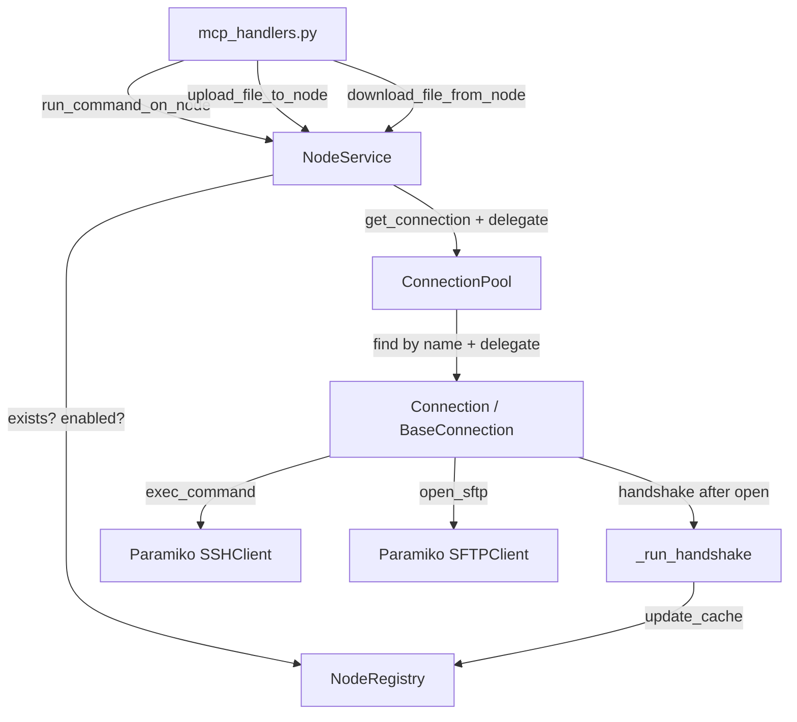

# Node Execution and Handshake API Slice — Architecture Plan

## Goal

Add node-scoped command execution and file transfer to the MCP API surface, and add a minimal post-connect handshake that populates `NodeInfoCache` with basic OS/node facts.

## Final API Surface After This Slice

```
get_node_status          ← existing
get_node_info            ← existing (gains real data via handshake)
get_agent_public_key     ← existing
add_node                 ← existing
remove_node              ← existing
enable_node              ← existing
disable_node             ← existing
run_command_on_node      ← NEW
upload_file_to_node      ← NEW
download_file_from_node  ← NEW
```

---

## Layer Responsibility Summary

```
mcp_handlers.py          — registers tools, delegates only, no logic
NodeService              — guards node state (exists? enabled?), delegates to pool
ConnectionPool           — looks up connection by name, delegates to Connection
Connection / BaseConnection — executes SSH commands, SFTP transfers, handshake
NodeInfoCache / NodeRegistry — stores handshake facts
```

---

## Architecture Diagram



---

## Detailed Design

### 1. `BaseConnection` — New Methods

**File:** [`agent/connectionpool/connection.py`](agent/connectionpool/connection.py)

#### `upload_file(remote_path: str, data_b64: str, mode: str = "0644") -> dict`

- Decode base64 `data_b64` to bytes
- Open SFTP via `self._ssh.open_sftp()`
- Write bytes to `remote_path` using `sftp.putfo()`
- `chmod` via `sftp.chmod(remote_path, int(mode, 8))`
- Return `{"status": "written", "path": remote_path}`
- Raises `RuntimeError` if not connected

#### `download_file(remote_path: str) -> dict`

- Open SFTP via `self._ssh.open_sftp()`
- Read remote file bytes via `sftp.getfo()` or `sftp.open()`
- Base64-encode result
- Return `{"status": "ok", "path": remote_path, "data_b64": "<b64>"}`
- Raises `RuntimeError` if not connected; returns `{"error": ..., "path": ...}` on `IOError`

Both methods acquire `self._lock` for thread safety.

#### `_run_handshake() -> dict`

Called internally after a successful `open()`. Runs a small set of SSH commands to collect node facts. Uses the existing `execute()` method.

Commands to run (best-effort — individual failures must not abort the full handshake):

| Fact | Command |
|---|---|
| `hostname` | `hostname` |
| `os_name` | `uname -s` |
| `os_version` | `uname -r` |
| `architecture` | `uname -m` |
| `current_user` | `whoami` |
| `shell` | `echo $SHELL` |

Collected fact structure per key:
```python
{
    "value": "<stdout.strip()>",
    "source": "handshake",
    "collected_at": "<ISO 8601 UTC>"
}
```

Returns a `dict` of fact-name → fact-object, plus a top-level `collected_at` ISO 8601 timestamp.

The `_run_handshake()` method must **not** raise — it logs errors and returns partial results.

`DirectConnection.open()` must call `self._run_handshake()` after the connection is established and store the result on `self._handshake_facts: dict`. The pool layer reads this after `open()` to update the registry.

### 2. `ConnectionPool` — New Methods + Handshake Wiring

**File:** [`agent/connectionpool/pool.py`](agent/connectionpool/pool.py)

#### New: `get_connection(name: str) -> Optional[Connection]`

- Thread-safe lookup by name
- Returns the `Connection` object or `None` if not in pool
- Used by the three new execution methods

#### New: `run_command_on_node(name: str, command: str) -> dict`

- Calls `get_connection(name)`; returns `{"error": "not_in_pool", "name": name}` if absent
- Delegates to `connection.execute(command)`
- Returns the `CommandResult.to_dict()` result
- Logs errors; does not swallow exceptions from `connection.execute()`

#### New: `upload_file_to_node(name: str, remote_path: str, data_b64: str, mode: str = "0644") -> dict`

- Calls `get_connection(name)`; returns `{"error": "not_in_pool", "name": name}` if absent
- Delegates to `connection.upload_file(remote_path, data_b64, mode)`

#### New: `download_file_from_node(name: str, remote_path: str) -> dict`

- Calls `get_connection(name)`; returns `{"error": "not_in_pool", "name": name}` if absent
- Delegates to `connection.download_file(remote_path)`

#### Handshake Integration in Pool

After a successful `connection.open()` (both in `start()` and `_monitor_once()`), the pool must read `connection._handshake_facts` and notify the registry via a callback/injected hook. The cleanest approach: inject an optional `on_handshake` callback into `ConnectionPool.__init__()`:

```python
def __init__(self, connection_configs, reconnection_delay=5, on_handshake=None):
    self._on_handshake = on_handshake  # callable(name, facts) or None
```

After every successful `connection.open()`:
```python
if self._on_handshake and hasattr(connection, '_handshake_facts'):
    self._on_handshake(connection.name, connection._handshake_facts)
```

This keeps the pool decoupled from the registry — the registry wiring lives in `run_agent.py`.

### 3. `NodeService` — New Methods

**File:** [`agent/nodes/service.py`](agent/nodes/service.py)

All three methods follow the same guard pattern:

```
1. Check registry.exists(name) → {"error": "node not found", "name": name}
2. Check config.enabled → {"error": "node_disabled", "name": name}
3. Delegate to pool.*_on_node / pool.*_to_node / pool.*_from_node
4. Return result dict from pool call
```

#### `run_command_on_node(name: str, command: str) -> dict`

- Guard: exists + enabled
- Delegate: `self._pool.run_command_on_node(name, command)`
- Returns `CommandResult.to_dict()` on success

#### `upload_file_to_node(name: str, remote_path: str, data_b64: str, mode: str = "0644") -> dict`

- Guard: exists + enabled
- Delegate: `self._pool.upload_file_to_node(name, remote_path, data_b64, mode)`

#### `download_file_from_node(name: str, remote_path: str) -> dict`

- Guard: exists + enabled
- Delegate: `self._pool.download_file_from_node(name, remote_path)`

### 4. `mcp_handlers.py` — New Tool Registrations

**File:** [`agent/mcp_handlers.py`](agent/mcp_handlers.py)

Add three new `@mcp.tool()` registrations that delegate only:

```python
@mcp.tool()
def run_command_on_node(name: str, command: str) -> dict:
    return node_service.run_command_on_node(name=name, command=command)

@mcp.tool()
def upload_file_to_node(name: str, remote_path: str, data_b64: str, mode: str = "0644") -> dict:
    return node_service.upload_file_to_node(name=name, remote_path=remote_path, data_b64=data_b64, mode=mode)

@mcp.tool()
def download_file_from_node(name: str, remote_path: str) -> dict:
    return node_service.download_file_from_node(name=name, remote_path=remote_path)
```

### 5. Handshake Wiring in `run_agent.py`

**File:** [`agent/run_agent.py`](agent/run_agent.py)

Wire the `on_handshake` callback:

```python
def _on_handshake(name: str, facts: dict):
    if registry.exists(name):
        from datetime import datetime, timezone
        collected_at = datetime.now(timezone.utc).isoformat()
        from agent.nodes.models import NodeInfoCache
        cache = NodeInfoCache(facts=facts, collected_at=collected_at)
        registry.update_cache(name, cache)

pool = ConnectionPool(connections, on_handshake=_on_handshake)
```

### 6. `NodeInfoCache` — No Model Changes Needed

[`agent/nodes/models.py`](agent/nodes/models.py) already has:
```python
@dataclass
class NodeInfoCache:
    facts: dict = field(default_factory=dict)
    collected_at: Optional[str] = None
```

The fact structure stored per key will follow the pattern already used in existing tests:
```python
{"value": "...", "source": "handshake", "collected_at": "<ISO 8601>"}
```

`get_node_info()` already returns `cache.facts` as the `"info"` field — no changes needed.

---

## Error Response Contracts

| Scenario | Response |
|---|---|
| Node not in registry | `{"error": "node not found", "name": "<name>"}` |
| Node disabled | `{"error": "node_disabled", "name": "<name>"}` |
| Node not in pool | `{"error": "not_in_pool", "name": "<name>"}` |
| SSH execution error | `{"error": "<message>", "name": "<name>"}` |
| File not found on node | `{"error": "<message>", "path": "<path>"}` |

---

## Test Plan

### Unit Tests — `tests/agent/nodes/test_node_service.py` (additions)

Add a new section: `NodeService — run_command_on_node / upload_file_to_node / download_file_from_node`.

All use `make_service()` with a mock pool. No live SSH.

| Test | What it verifies |
|---|---|
| `test_run_command_on_node_delegates_to_pool` | Pool's `run_command_on_node` called with correct args |
| `test_run_command_on_node_unknown_node_returns_error` | Returns `node not found` for unknown name |
| `test_run_command_on_node_disabled_node_returns_error` | Returns `node_disabled` when `enabled=False` |
| `test_upload_file_to_node_delegates_to_pool` | Pool's `upload_file_to_node` called with correct args |
| `test_upload_file_to_node_disabled_node_returns_error` | Returns `node_disabled` when `enabled=False` |
| `test_download_file_from_node_delegates_to_pool` | Pool's `download_file_from_node` called |
| `test_download_file_from_node_disabled_node_returns_error` | Returns `node_disabled` when `enabled=False` |

### Unit Tests — `tests/agent/connectionpool/test_connection.py` (additions)

Using mock `SSHClient` / `SFTPClient`:

| Test | What it verifies |
|---|---|
| `test_upload_file_uses_sftp` | `open_sftp()` is called and bytes are written |
| `test_download_file_uses_sftp` | `open_sftp()` is called and b64 result returned |
| `test_run_handshake_populates_facts` | After open(), `_handshake_facts` contains hostname, os, arch, user |
| `test_run_handshake_partial_failure_does_not_raise` | Individual command failures produce partial facts, no exception |

### Functional Tests — `tests/functional/test_node_execution_functional.py` (NEW FILE)

All marked `@pytest.mark.functional` and `@pytest.mark.requires_sshd`. Use the `spawn_sshd` fixture and build a full `NodeService` stack (pool + registry + service).

| Test | What it verifies |
|---|---|
| `test_run_command_on_node_echo_hello` | `run_command_on_node("test-node", "echo hello")` stdout == "hello\n" |
| `test_run_command_on_node_nonzero_exit_code` | `run_command_on_node` with `exit 42` captures `exit_code == 42` |
| `test_run_command_on_node_disabled_node_rejected` | After `disable_node`, returns `node_disabled` error |
| `test_upload_file_to_node_writes_file` | Upload b64-encoded content, then SSH `cat` to verify |
| `test_download_file_from_node_reads_file` | SSH `echo` to write a file, then download and verify b64 |
| `test_handshake_populates_get_node_info` | After pool.start(), `get_node_info()` shows hostname/os/architecture in facts |

---

## Files Changed / Created

| File | Change |
|---|---|
| [`agent/connectionpool/connection.py`](agent/connectionpool/connection.py) | Add `upload_file()`, `download_file()`, `_run_handshake()` to `BaseConnection`; call `_run_handshake()` in `DirectConnection.open()` |
| [`agent/connectionpool/pool.py`](agent/connectionpool/pool.py) | Add `get_connection()`, `run_command_on_node()`, `upload_file_to_node()`, `download_file_from_node()`; add `on_handshake` callback wiring |
| [`agent/nodes/service.py`](agent/nodes/service.py) | Add `run_command_on_node()`, `upload_file_to_node()`, `download_file_from_node()` with guard pattern |
| [`agent/mcp_handlers.py`](agent/mcp_handlers.py) | Register three new MCP tools |
| [`agent/run_agent.py`](agent/run_agent.py) | Wire `on_handshake` callback from pool to registry |
| [`tests/agent/nodes/test_node_service.py`](tests/agent/nodes/test_node_service.py) | Add unit tests for three new NodeService methods |
| [`tests/agent/connectionpool/test_connection.py`](tests/agent/connectionpool/test_connection.py) | Add unit tests for `upload_file`, `download_file`, `_run_handshake` |
| [`tests/functional/test_node_execution_functional.py`](tests/functional/test_node_execution_functional.py) | **NEW** — all 6 functional tests |

---

## Implementation Constraints (carry-forward from slice spec)

- Handlers delegate only — no logic in `mcp_handlers.py`
- `NodeService` owns the enabled/exists guard; pool does not re-check
- `Connection` owns SSH execution and SFTP mechanics; pool does not open SFTP directly
- `NodeInfoCache` stores handshake facts; pool calls the callback, registry stores
- Disabled nodes must be rejected by `NodeService` before pool is called
- Unknown nodes must be rejected by `NodeService` before pool is called
- Existing `run_command` and `upload_file` remain unchanged (legacy/local)
- `_run_handshake()` must never raise; partial facts are acceptable
- The `on_handshake` callback in the pool must be optional (default `None`) to avoid breaking existing pool tests

---

## Non-Goals (not in this slice)

- Full capability discovery
- Execution history / audit trail
- Reverse tunnel lifecycle
- Password-based bootstrap
- Workflow orchestration
- Background agents
- `TunnelConnection` handshake support (only `DirectConnection` in this slice)
