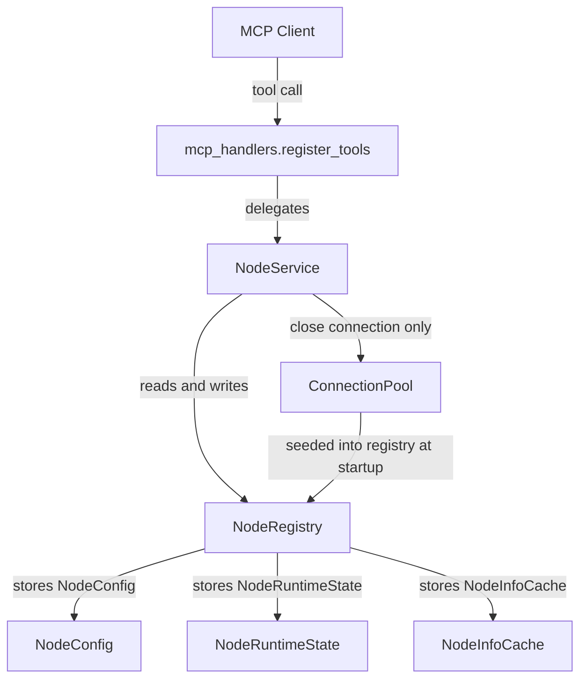

# Node Management API — Structural Slice

## Slice name

**Node Management API structural slice**

## Purpose

Introduce a clean node-oriented MCP API surface. Make the API shape and internal seams solid. Implement only the behavior required for this slice.

---

## API surface

```text
get_status
get_node_info
add_node
remove_node
enable_node
disable_node
```

No other new MCP tools are introduced in this slice.

---

## Terminology

**Node** is the primary noun throughout — public API, internal modules, tests, and documentation.

A node is a configured SSH-reachable execution environment managed by the gateway.

Terms `device`, `edge`, `remote`, and `target` must not appear in new code or documentation.

### Retirement in this slice

`get_device_info` is **retired**. The "device" noun is prohibited on the public API. The tool is removed from `mcp_handlers.py`. Its platform-info function is available through `get_node_info` when discovery is implemented in a future slice.

### Kept without change

`run_command` and `upload_file` are execution primitives not related to node naming. They are kept as-is. Refactoring execution tools is deferred.

### Transport/infrastructure layer

`ConnectionPool`, `Connection`, and `ConnectionConfig` retain their internal naming. These are infrastructure-layer concepts, not public API nouns. No renaming of the connection layer in this slice.

---

## What this slice does and does not implement

### Implemented in this slice

| Behavior | Implemented |
|----------|-------------|
| `get_status` returns gateway status + all configured nodes with enabled/pool state | Yes |
| `get_node_info` returns configured info and cached/pool state per node | Yes (shape + configured info; live discovery stubbed) |
| `add_node` API seam and credential safety contract | Yes (bootstrap returns `not_implemented`) |
| `remove_node` removes node from registry, closes active pool connection | Yes |
| `disable_node` marks node disabled, closes runtime connection, keeps config | Yes |
| `enable_node` marks node enabled, does not eagerly connect | Yes |
| Internal node model: `NodeConfig`, `NodeRuntimeState`, `NodeInfoCache` | Yes |
| `NodeRegistry` in-memory store | Yes |
| `NodeService` service layer | Yes |
| `register_tools(mcp, node_service)` handler signature | Yes |
| Pytest coverage for all 6 tools | Yes |
| MCP validation evidence | Yes |

### Not implemented in this slice

| Behavior | Deferred |
|----------|---------|
| Password-based SSH key installation and bootstrap | Deferred |
| `validate=true` live connectivity test in `enable_node` | Deferred |
| `refresh=true` live SSH probing in `get_node_info` | Deferred |
| Full capability discovery | Deferred |
| Execution routing through enabled-check | Deferred |
| Reverse tunnel listener lifecycle | Deferred |
| Dynamic tunnel registration | Deferred |
| Node info persistence | Deferred (in-memory only) |
| Remote key removal on `remove_node` | Deferred |
| Execution history | Deferred |
| Custom REST endpoints | Deferred |
| Broad workflow orchestration | Deferred |

---

## Current state

| File | Relevant content |
|------|-----------------|
| [`agent/mcp_handlers.py`](../agent/mcp_handlers.py) | `register_tools(mcp)` — no pool or node awareness. Tools: `get_status` (returns `{"status":"ok"}`), `get_device_info`, `run_command`, `upload_file` |
| [`agent/connectionpool/pool.py`](../agent/connectionpool/pool.py) | `ConnectionPool` — manages `Connection` objects. Has `query_pool()` and connection close APIs |
| [`agent/connectionpool/config_loader.py`](../agent/connectionpool/config_loader.py) | `ConnectionConfig` dataclass, `ConnectionMode` enum |
| [`agent/run_agent.py`](../agent/run_agent.py) | Builds pool, calls `mcp_handlers.register_tools(mcp)` — does not pass pool to handlers |
| [`agent/connectionpool/connection.py`](../agent/connectionpool/connection.py) | `Connection` facade, `ConnectionState` enum |

Problems resolved by this slice:

- Handlers have no access to pool or node state.
- `get_status` returns only `{"status": "ok"}` — no node information.
- No internal node model or registry exists.
- `get_device_info` uses prohibited "device" terminology.
- No node-management tools exist.

---

## New file structure

```
agent/
  nodes/
    __init__.py
    models.py        ← NodeConfig, NodeRuntimeState, NodeInfoCache
    registry.py      ← NodeRegistry (in-memory, thread-safe)
    service.py       ← NodeService (business logic)
  mcp_handlers.py    ← updated: register_tools(mcp, node_service); get_device_info removed
  run_agent.py       ← updated: seed registry, construct NodeService, pass to register_tools

tests/
  agent/
    nodes/
      __init__.py
      test_node_service.py
    test_mcp_node_tools.py
```

---

## Internal model

### `agent/nodes/models.py`

```python
@dataclass
class NodeConfig:
    name: str
    mode: str           # "direct" | "tunnel"
    enabled: bool
    host: Optional[str]
    port: int
    user: str
    id_file: Optional[str]

@dataclass
class NodeRuntimeState:
    pool_state: str     # "open" | "closed" | "opening" | "broken" | "unknown"
    reachable: bool
    last_seen_at: Optional[str]   # ISO 8601 string or null
    last_error: Optional[str]

@dataclass
class NodeInfoCache:
    facts: dict         # e.g. {"hostname": {"value": "...", "source": "cache", "collected_at": null}}
    collected_at: Optional[str]
```

`NodeRuntimeState` defaults to `pool_state="unknown"`, `reachable=False`, no error.
`NodeInfoCache` defaults to `facts={}`, `collected_at=None`.

### `agent/nodes/registry.py` — `NodeRegistry`

- In-memory store: `dict[str, tuple[NodeConfig, NodeRuntimeState, NodeInfoCache]]`
- Thread-safe via `threading.Lock`
- Public interface:
  - `add(config: NodeConfig) -> None` — adds with default runtime state and empty cache
  - `remove(name: str) -> None` — raises `KeyError` if not found
  - `get(name: str) -> tuple[NodeConfig, NodeRuntimeState, NodeInfoCache]` — raises `KeyError` if not found
  - `all() -> list[tuple[NodeConfig, NodeRuntimeState, NodeInfoCache]]`
  - `exists(name: str) -> bool`
  - `update_config(name: str, config: NodeConfig) -> None`
  - `update_runtime(name: str, state: NodeRuntimeState) -> None`

### `agent/nodes/service.py` — `NodeService`

```python
class NodeService:
    def __init__(self, registry: NodeRegistry, pool: ConnectionPool): ...

    def get_status(self) -> dict: ...
    def get_node_info(self, name: Optional[str], refresh: bool) -> dict: ...
    def add_node(self, name, host, port, user, password, mode) -> dict: ...
    def remove_node(self, name) -> dict: ...
    def enable_node(self, name, validate: bool) -> dict: ...
    def disable_node(self, name) -> dict: ...
```

`NodeService` holds a reference to `ConnectionPool` only to close active connections during `remove_node` and `disable_node`. It must not directly manipulate connection internals beyond calling `connection.close()`.

---

## `register_tools` signature change

**Before** (`agent/run_agent.py` + `agent/mcp_handlers.py`):
```python
mcp_handlers.register_tools(mcp)
```

**After**:
```python
# agent/run_agent.py
from agent.nodes.models import NodeConfig, NodeRuntimeState, NodeInfoCache
from agent.nodes.registry import NodeRegistry
from agent.nodes.service import NodeService

registry = NodeRegistry()
for conn in pool.connections:
    cfg = NodeConfig(
        name=conn.name,
        mode=conn.mode.value,
        enabled=True,
        host=conn.host,
        port=conn.port,
        user=conn.user,
        id_file=conn.id_file,
    )
    registry.add(cfg)

node_service = NodeService(registry=registry, pool=pool)
mcp_handlers.register_tools(mcp, node_service)
```

```python
# agent/mcp_handlers.py
def register_tools(mcp: FastMCP, node_service: NodeService): ...
```

---

## API contracts

### `get_status`

- Must not perform live SSH access.
- Must not fail if no nodes are configured.
- Reads from registry and current pool connection states only.
- Pool state is derived by inspecting `pool.connections` for matching names.

Response shape:

```json
{
  "status": "ok",
  "nodes": [
    {
      "name": "lab-pi-01",
      "mode": "direct",
      "enabled": true,
      "configured": true,
      "pool_state": "open",
      "reachable": true,
      "last_seen_at": null,
      "last_error": null,
      "cached_info_available": false
    }
  ]
}
```

Empty case: `{"status": "ok", "nodes": []}`.

### `get_node_info`

Input: `{ "name": "lab-pi-01", "refresh": false }`

Rules:
- `name` is optional. Omit to return all configured nodes.
- `refresh` defaults to `false`.
- `refresh=false`: returns configured info, cached facts, and current pool state. No live SSH.
- `refresh=true`: stubbed in this slice — returns same as `refresh=false` with a note that live refresh is not yet implemented.
- Unknown `name`: returns `{"error": "node not found", "name": "..."}`.

Response shape:

```json
{
  "nodes": [
    {
      "name": "lab-pi-01",
      "enabled": true,
      "pool_state": "open",
      "info": {}
    }
  ]
}
```

`info` contains cached facts if any exist, otherwise `{}`. The shape of individual facts follows `{"value": ..., "source": "cache", "collected_at": null}`. In this slice, facts will be empty for newly added nodes.

### `add_node`

Input: `{ "name", "host", "port", "user", "password", "mode" }`

Credential safety contract (non-negotiable):
- `password` is a function parameter only.
- It must **not** be assigned to any variable that persists beyond the call frame.
- It must **not** appear in any log statement.
- It must **not** be included in the return value.
- It must **not** be included in test snapshots or assertions on content.
- It must **not** be stored in config, cache, registry, or any file.

Bootstrap behavior:
- Key installation and passwordless validation are **not implemented** in this slice.
- The function acknowledges receipt of the request and returns an honest partial result.

Response (bootstrap not implemented):

```json
{
  "status": "bootstrap_not_implemented",
  "name": "lab-pi-01",
  "reason": "password-based bootstrap is not implemented in this slice"
}
```

The node is **not added to the registry** in this slice if bootstrap cannot be validated. An explicit registry add without bootstrap is acceptable only if the implementation adds a note in the response that passwordless access has not been verified. The preferred behavior is to return `bootstrap_not_implemented` and not add.

### `remove_node`

Input: `{ "name": "lab-pi-01" }`

Rules:
- Must not require the node to be reachable.
- Closes active pool connection for this node if one exists.
- Removes node from registry.
- Unknown name: returns `{"error": "node not found", "name": "..."}`.

Response:

```json
{ "status": "removed", "name": "lab-pi-01" }
```

### `enable_node`

Input: `{ "name": "lab-pi-01", "validate": false }`

Rules:
- Sets `enabled=True` in registry config.
- Does not open an SSH connection.
- `validate=true` is stubbed — acknowledged but not acted on in this slice.
- Unknown name: returns `{"error": "node not found", "name": "..."}`.

Response:

```json
{ "status": "enabled", "name": "lab-pi-01" }
```

### `disable_node`

Input: `{ "name": "lab-pi-01" }`

Rules:
- Sets `enabled=False` in registry config.
- Closes active pool connection for this node if one exists.
- Node remains in registry — still visible in `get_status`.
- Cached info is preserved.
- Unknown name: returns `{"error": "node not found", "name": "..."}`.

Response:

```json
{ "status": "disabled", "name": "lab-pi-01" }
```

---

## Data flow



---

## Testing plan

### `tests/agent/nodes/test_node_service.py`

Unit tests for `NodeService`. All tests use a real `NodeRegistry` instance and a mocked `ConnectionPool`. No live SSH.

| Test | Validates |
|------|-----------|
| `test_get_status_empty_registry` | Returns `{"status": "ok", "nodes": []}` |
| `test_get_status_includes_node_fields` | Returns `enabled`, `pool_state`, `configured`, `cached_info_available` per node |
| `test_add_node_returns_bootstrap_not_implemented` | Status is `bootstrap_not_implemented`, reason is present |
| `test_add_node_result_contains_no_password` | Return value dict has no `password` key |
| `test_remove_node_removes_from_status` | Node absent from `get_status` after removal |
| `test_remove_node_unknown_returns_error` | Error shape returned for unknown name |
| `test_disable_node_marks_disabled` | `enabled=False` in `get_status`, node still present |
| `test_disable_node_calls_pool_close` | Pool connection close called for matching node |
| `test_enable_node_marks_enabled` | `enabled=True` in `get_status` |
| `test_get_node_info_all_nodes` | Returns list of all configured nodes |
| `test_get_node_info_single_node` | Returns only the named node |
| `test_get_node_info_unknown_node` | Returns `{"error": "node not found", ...}` |
| `test_get_node_info_refresh_false_no_ssh` | No SSH interaction on `refresh=false` |

### `tests/agent/test_mcp_node_tools.py`

Handler-level tests. Tests verify tool registration and basic response contracts. All use mocked `NodeService`.

| Test | Validates |
|------|-----------|
| `test_tool_registration_includes_all_six_node_tools` | All 6 tool names registered |
| `test_get_device_info_not_registered` | `get_device_info` is absent from registered tools |
| `test_get_status_response_has_status_and_nodes` | Response has `status` and `nodes` keys |
| `test_disable_node_keeps_node_in_status` | Disabled node still present in `get_status` result |
| `test_enable_node_returns_enabled_shape` | `{"status": "enabled", "name": ...}` |
| `test_remove_node_returns_removed_shape` | `{"status": "removed", "name": ...}` |
| `test_add_node_returns_bootstrap_not_implemented` | Status is `bootstrap_not_implemented` |
| `test_add_node_result_has_no_password_field` | No password in return value |
| `test_get_node_info_all_returns_nodes_list` | Response has `nodes` list |
| `test_get_node_info_single_returns_one_node` | Response has one-node `nodes` list |
| `test_get_node_info_unknown_returns_error` | Error response for unknown name |

---

## Documentation updates

### [`docs/SECURITY.md`](../docs/SECURITY.md)

Add a new section **Assisted Node Onboarding** covering:

- `add_node` may accept a temporary password for assisted onboarding.
- Temporary credentials are used only to install the gateway public key and verify passwordless SSH.
- Credentials must never be stored, logged, echoed, cached, or included in responses.
- Password-based bootstrap is not yet implemented. The current implementation returns an explicit `bootstrap_not_implemented` result.
- Documentation must clearly distinguish implemented behavior from intended onboarding behavior.

### [`docs/MCP_VALIDATION_GUIDE.md`](../docs/MCP_VALIDATION_GUIDE.md)

- Update the smoke test tool list to include the 6 node tools.
- Remove `get_device_info` from the smoke test (tool is retired).
- Add invocation examples for `get_status`, `get_node_info`, `add_node`, `disable_node`, `enable_node`, `remove_node`.

### [`docs/ARCHITECTURE.md`](../docs/ARCHITECTURE.md)

- Update "Current Implementation Boundary" section to mention the node-oriented MCP API surface, `NodeRegistry`, and `NodeService`.
- Keep all existing content.

No large new documents are introduced.

---

## Development and testing loop

This slice uses TDD and live MCP validation together. MCP validation is not a final checkbox — use it early once structural tool registration exists, because the point of this slice is to establish the product-facing API surface.

### Iteration loop

```
1. Define expected contract for the next API behavior.
2. Add pytest coverage for that deterministic behavior first (TDD).
3. Implement the minimal internal model and handler wiring to satisfy it.
4. Run targeted pytest after each behavior is introduced.
5. Once basic tool registration exists, start the gateway and validate exposed tools through Roo MCP.
6. Use MCP findings to harden pytest where the product surface behaves differently than expected.
7. Repeat until pytest and live MCP evidence agree on all 6 tools.
```

### Pytest coverage requirements (first-class deliverable)

At minimum, pytest must cover:

| Behavior | Test file |
|----------|-----------|
| Tool registration for all 6 APIs | `test_mcp_node_tools.py` |
| `get_device_info` absent from registration | `test_mcp_node_tools.py` |
| `get_status` response shape | both |
| `get_node_info` response shape | both |
| Unknown node handling | `test_node_service.py` |
| `enable_node` / `disable_node` state transitions | `test_node_service.py` |
| `remove_node` removes node from status | `test_node_service.py` |
| `add_node` password not stored, not logged, not echoed, not in return value | `test_node_service.py` |
| `add_node` explicit `bootstrap_not_implemented` result | both |

For mutating tools, tests use safe synthetic test data and validate request/response shape and state transitions only — no real SSH credentials, no real network targets.

### MCP validation gate

This slice changes MCP tool registration, tool names, and response shapes. The MCP validation gate from [`docs/MCP_VALIDATION_GUIDE.md`](../docs/MCP_VALIDATION_GUIDE.md) applies.

After pytest passes:

1. Start gateway: `python3 app.py`
2. Endpoint: `http://localhost:8000/mcp`
3. Confirm all 6 node tools are visible and `get_device_info` is absent.
4. Invoke in order: `get_status`, `get_node_info`, `add_node`, `disable_node`, `enable_node`, `remove_node`
5. For mutating tools, use safe test data — validate request/response shape and state transitions, not real onboarding.
6. Record the standard evidence block per the validation guide.

---

## Delivery checklist

- [ ] `agent/nodes/__init__.py`
- [ ] `agent/nodes/models.py` — `NodeConfig`, `NodeRuntimeState`, `NodeInfoCache`
- [ ] `agent/nodes/registry.py` — `NodeRegistry`
- [ ] `agent/nodes/service.py` — `NodeService`
- [ ] `agent/mcp_handlers.py` — `register_tools(mcp, node_service)`, 6 node tools, `get_device_info` removed
- [ ] `agent/run_agent.py` — seed registry from pool, construct `NodeService`, pass to `register_tools`
- [ ] `tests/agent/nodes/__init__.py`
- [ ] `tests/agent/nodes/test_node_service.py`
- [ ] `tests/agent/test_mcp_node_tools.py`
- [ ] `docs/SECURITY.md` — assisted onboarding credential section
- [ ] `docs/MCP_VALIDATION_GUIDE.md` — updated smoke test
- [ ] `docs/ARCHITECTURE.md` — node API surface in current boundary
- [ ] All existing tests still pass
- [ ] All new tests pass
- [ ] MCP validation evidence recorded
