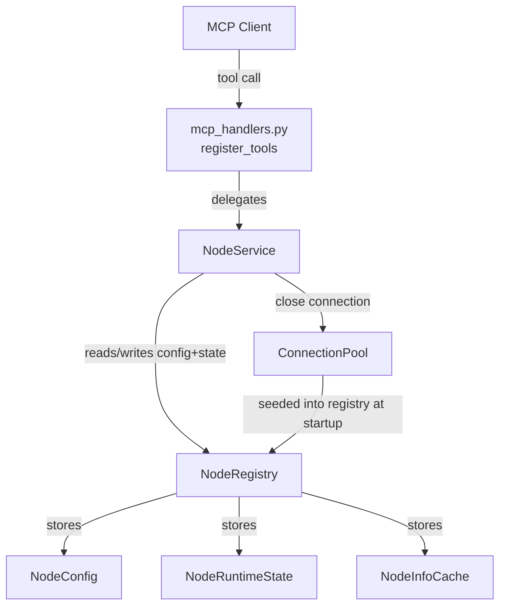

# Node-Management MCP API Slice — Architecture & Delivery Plan

## Purpose

Introduce a clean node-oriented MCP API surface:

```
get_status
get_node_info
add_node
remove_node
enable_node
disable_node
```

This slice establishes the structure, contracts, tests, and basic behavior. The implementation is minimal and avoids speculative infrastructure.

## Terminology

**Node** is the primary public noun throughout the entire codebase — public API, internal modules, tests, and documentation.

A node is a configured SSH-reachable execution environment managed by the gateway.

Terms `device`, `edge`, `remote`, and `target` must not appear as public API nouns or in new internal code. Existing legacy code that uses these terms must be migrated as part of this slice:

- The `get_device_info` MCP tool is renamed to `get_node_info` (which is already one of the 6 new tools — `get_device_info` is retired).
- New modules (`agent/nodes/`) use "node" exclusively.
- No new code introduces the legacy terms.

The underlying SSH connection layer (`ConnectionPool`, `Connection`, `ConnectionConfig`) retains its current naming — these are transport/infrastructure-layer concepts, not public API nouns. No renaming of the connection layer is required in this slice.

---

## Current State

| File | Relevant content |
|------|-----------------|
| [`agent/mcp_handlers.py`](../agent/mcp_handlers.py) | `register_tools(mcp)` — flat, no pool/node awareness. Tools: `get_status`, `get_device_info`, `run_command`, `upload_file` |
| [`agent/connectionpool/pool.py`](../agent/connectionpool/pool.py) | `ConnectionPool` — manages `Connection` objects from config |
| [`agent/connectionpool/config_loader.py`](../agent/connectionpool/config_loader.py) | `ConnectionConfig` dataclass, `ConnectionMode` enum, JSON config loader |
| [`agent/run_agent.py`](../agent/run_agent.py) | Builds pool, calls `mcp_handlers.register_tools(mcp)` — does not pass pool to handlers |
| [`agent/connectionpool/connection.py`](../agent/connectionpool/connection.py) | `Connection` facade, `ConnectionState`, `DirectConnection`, `TunnelConnection` |

Problems the slice resolves:

- Handlers have no access to pool or node state.
- `get_status` returns only `{"status": "ok"}` — no node information.
- There is no internal node model or registry.
- The API surface uses legacy terminology (`get_device_info`) and has no node-management tools.

---

## Architecture

### System shape after this slice

```
MCP Client
    ↓
mcp_handlers.register_tools(mcp, node_service)
    ↓
NodeService
    ├── NodeRegistry  (node config + runtime state + info cache)
    └── ConnectionPool  (reference, used only to close connections)
```

### New module layout

```
agent/
  nodes/
    __init__.py
    models.py        ← NodeConfig, NodeRuntimeState, NodeInfoCache
    registry.py      ← NodeRegistry
    service.py       ← NodeService
  mcp_handlers.py    ← updated: register_tools(mcp, node_service)
  run_agent.py       ← updated: constructs NodeService, passes to register_tools

tests/
  agent/
    nodes/
      __init__.py
      test_node_service.py
    test_mcp_node_tools.py
```

---

## Internal Model

### `agent/nodes/models.py`

```python
@dataclass
class NodeConfig:
    name: str
    mode: str           # "direct" or "tunnel"
    enabled: bool
    host: Optional[str]
    port: int
    user: str
    id_file: Optional[str]

@dataclass
class NodeRuntimeState:
    pool_state: str     # "open" | "closed" | "opening" | "broken" | "unknown"
    reachable: bool
    last_seen_at: Optional[str]   # ISO 8601 or null
    last_error: Optional[str]

@dataclass
class NodeInfoCache:
    facts: dict         # {"hostname": {"value": "...", "source": "cache", "collected_at": null}}
    collected_at: Optional[str]
```

`NodeRuntimeState` and `NodeInfoCache` default to safe empty/unknown values on construction.

### `agent/nodes/registry.py` — `NodeRegistry`

- In-memory store: `dict[str, tuple[NodeConfig, NodeRuntimeState, NodeInfoCache]]`
- Thread-safe via `threading.Lock`
- Public methods:
  - `add(config: NodeConfig) -> None`
  - `remove(name: str) -> None`  — raises `KeyError` if not found
  - `get(name: str) -> tuple[NodeConfig, NodeRuntimeState, NodeInfoCache]` — raises `KeyError` if not found
  - `all() -> list[tuple[NodeConfig, NodeRuntimeState, NodeInfoCache]]`
  - `exists(name: str) -> bool`
  - `update_runtime(name: str, state: NodeRuntimeState) -> None`

Registry is seeded at startup from the existing `ConnectionPool` connections, bridging legacy config into the node model.

### `agent/nodes/service.py` — `NodeService`

```python
class NodeService:
    def __init__(self, registry: NodeRegistry, pool: ConnectionPool): ...

    def get_status(self) -> dict: ...
    def get_node_info(self, name: Optional[str], refresh: bool) -> dict: ...
    def add_node(self, name, host, port, user, password, mode) -> dict: ...
    def remove_node(self, name) -> dict: ...
    def enable_node(self, name, validate) -> dict: ...
    def disable_node(self, name) -> dict: ...
```

`NodeService` holds a reference to `ConnectionPool` only to close active connections during `remove_node` and `disable_node`. It does not directly manipulate connection internals beyond calling `connection.close()`.

---

## API Contracts

### `get_status`

- Must not perform live SSH access.
- Returns gateway status and every configured node.

```json
{
  "status": "ok",
  "nodes": [
    {
      "name": "lab-pi-01",
      "mode": "direct",
      "enabled": true,
      "configured": true,
      "pool_state": "open",
      "reachable": true,
      "last_seen_at": null,
      "last_error": null,
      "cached_info_available": false
    }
  ]
}
```

### `get_node_info`

Input: `{ "name": "lab-pi-01", "refresh": false }`

- `name` optional — omit to return all nodes.
- `refresh=false` (default): returns configured info, cached info, and current pool state.
- `refresh=true`: may probe live; stubbed in this slice.

```json
{
  "nodes": [
    {
      "name": "lab-pi-01",
      "enabled": true,
      "pool_state": "open",
      "info": {
        "hostname": {
          "value": "raspberrypi",
          "source": "cache",
          "collected_at": null
        }
      }
    }
  ]
}
```

Unknown node: returns `{"error": "node not found", "name": "..."}`.

### `add_node`

Input: `{ "name", "host", "port", "user", "password", "mode" }`

- Password is temporary bootstrap material.
- **Must not be stored. Must not be logged.**
- Bootstrap step (key installation + passwordless validation) is not implemented in this slice.
- Returns `not_implemented` with clear reason.

```json
{
  "status": "not_implemented",
  "name": "lab-pi-01",
  "reason": "password-based bootstrap is not implemented in this slice"
}
```

### `remove_node`

Input: `{ "name": "lab-pi-01" }`

- Closes active pool connection if present.
- Removes node from registry.
- Does not require node reachability.

```json
{ "status": "removed", "name": "lab-pi-01" }
```

### `enable_node`

Input: `{ "name": "lab-pi-01", "validate": false }`

- Sets `enabled=True`.
- Does not open SSH connection unless `validate=true`.
- `validate=true` is a stub in this slice.

```json
{ "status": "enabled", "name": "lab-pi-01" }
```

### `disable_node`

Input: `{ "name": "lab-pi-01" }`

- Sets `enabled=False`.
- Closes active pool connection.
- Keeps node in registry (visible in `get_status`).
- Keeps cached info.

```json
{ "status": "disabled", "name": "lab-pi-01" }
```

---

## Handler Registration Change

**Before:**
```python
# agent/run_agent.py
mcp_handlers.register_tools(mcp)
```

**After:**
```python
# agent/run_agent.py
from agent.nodes.registry import NodeRegistry
from agent.nodes.service import NodeService

registry = NodeRegistry()
# Seed registry from pool connections
for conn in pool.connections:
    from agent.nodes.models import NodeConfig, NodeRuntimeState, NodeInfoCache
    cfg = NodeConfig(
        name=conn.name, mode=conn.mode.value, enabled=True,
        host=conn.host, port=conn.port, user=conn.user, id_file=conn.id_file
    )
    registry.add(cfg)

node_service = NodeService(registry=registry, pool=pool)
mcp_handlers.register_tools(mcp, node_service)
```

`mcp_handlers.register_tools` signature changes to `register_tools(mcp, node_service)`.

---

## Data Flow



---

## Legacy Tools

### `get_device_info` — retired in this slice

`get_device_info` uses the prohibited "device" noun on the public API. It is **removed** in this slice. Its intended function (returning system/platform info for a node) is subsumed by `get_node_info`.

The existing `test_run_agent_wiring.py` tests do not reference `get_device_info` directly and will not break. Any test that referenced `get_device_info` by name must be updated or removed.

### `run_command` and `upload_file` — kept

`run_command` and `upload_file` are execution primitives unrelated to node management terminology. They are **kept** without change in this slice. Refactoring or extension of execution tools is deferred to a future slice.

---

## Testing Plan

### `tests/agent/nodes/test_node_service.py`

| Test | Assertion |
|------|-----------|
| `test_get_status_empty_registry` | Returns `{"status": "ok", "nodes": []}` |
| `test_get_status_with_node` | Returns node with enabled, pool_state, configured fields |
| `test_add_node_returns_not_implemented` | Status is `not_implemented`, reason present |
| `test_add_node_password_not_in_result` | Return value contains no password field |
| `test_remove_node_removes_from_status` | Node absent from `get_status` after removal |
| `test_remove_node_unknown_returns_error` | Error response for unknown name |
| `test_disable_node_marks_disabled` | Node `enabled=False`, still in `get_status` |
| `test_enable_node_marks_enabled` | Node `enabled=True` |
| `test_get_node_info_all_nodes` | Returns all configured nodes |
| `test_get_node_info_single_node` | Returns only named node |
| `test_get_node_info_unknown_node` | Returns clear error |

### `tests/agent/test_mcp_node_tools.py`

| Test | Assertion |
|------|-----------|
| `test_tool_registration_includes_all_node_tools` | All 6 tool names registered |
| `test_get_status_response_shape` | Has `status`, `nodes` keys |
| `test_disable_node_visible_in_status` | Disabled node still in `get_status` |
| `test_enable_node_response` | Returns `{"status": "enabled", "name": ...}` |
| `test_remove_node_gone_from_status` | Node absent after removal |
| `test_add_node_no_password_stored` | Response has no password; status is `not_implemented` |
| `test_get_node_info_all` | Returns nodes list |
| `test_get_node_info_one` | Returns single node |
| `test_get_node_info_unknown` | Returns error |

All tests use mocked pool. No live SSH required.

---

## Documentation Updates

| File | Change |
|------|--------|
| [`docs/SECURITY.md`](../docs/SECURITY.md) | Add section: `add_node` accepts temporary credentials for assisted onboarding. Credentials must never be stored or logged. Intended behavior uses credentials only to install the gateway public key and verify passwordless SSH. Documents what is implemented vs. intended. |
| [`docs/MCP_VALIDATION_GUIDE.md`](../docs/MCP_VALIDATION_GUIDE.md) | Update smoke test tool list: add `get_node_info`, `add_node`, `remove_node`, `enable_node`, `disable_node`. Update invocation guidance to reference node tools. |
| [`docs/ARCHITECTURE.md`](../docs/ARCHITECTURE.md) | Update "Current Implementation Boundary": mention node-oriented MCP API surface, `NodeRegistry`, `NodeService`. Keep existing content. |

No large new conceptual documents are added.

---

## Non-Goals for This Slice

The following are explicitly out of scope:

- Password-based SSH key bootstrap (key installation + passwordless validation)
- Reverse tunnel listener lifecycle
- Dynamic tunnel registration
- Capability discovery
- Full node inventory system
- Execution history
- Remote key removal during offboarding
- Persistence (all state is in-memory)
- `validate=true` live connectivity in `enable_node`
- Execution tools routing through enabled-check

---

## MCP Validation Gate

This slice changes MCP-exposed tool registration, names, and response shapes. The MCP validation gate applies.

After pytest passes:

1. Start gateway: `python3 app.py`
2. Endpoint: `http://localhost:8000/mcp`
3. Validate all 6 new tools are visible
4. Invoke: `get_status`, `get_node_info`, `add_node`, `disable_node`, `enable_node`, `remove_node`
5. Record standard evidence block per [`docs/MCP_VALIDATION_GUIDE.md`](../docs/MCP_VALIDATION_GUIDE.md)

---

## Delivery Checklist

- [ ] `agent/nodes/__init__.py`
- [ ] `agent/nodes/models.py` — NodeConfig, NodeRuntimeState, NodeInfoCache
- [ ] `agent/nodes/registry.py` — NodeRegistry
- [ ] `agent/nodes/service.py` — NodeService
- [ ] `agent/mcp_handlers.py` — updated signature + 6 node tools
- [ ] `agent/run_agent.py` — seed registry, construct NodeService, pass to register_tools
- [ ] `tests/agent/nodes/__init__.py`
- [ ] `tests/agent/nodes/test_node_service.py`
- [ ] `tests/agent/test_mcp_node_tools.py`
- [ ] `docs/SECURITY.md` — add_node credential section
- [ ] `docs/MCP_VALIDATION_GUIDE.md` — updated smoke test
- [ ] `docs/ARCHITECTURE.md` — node API surface mention
- [ ] pytest passes (all existing + new tests)
- [ ] MCP validation evidence recorded
