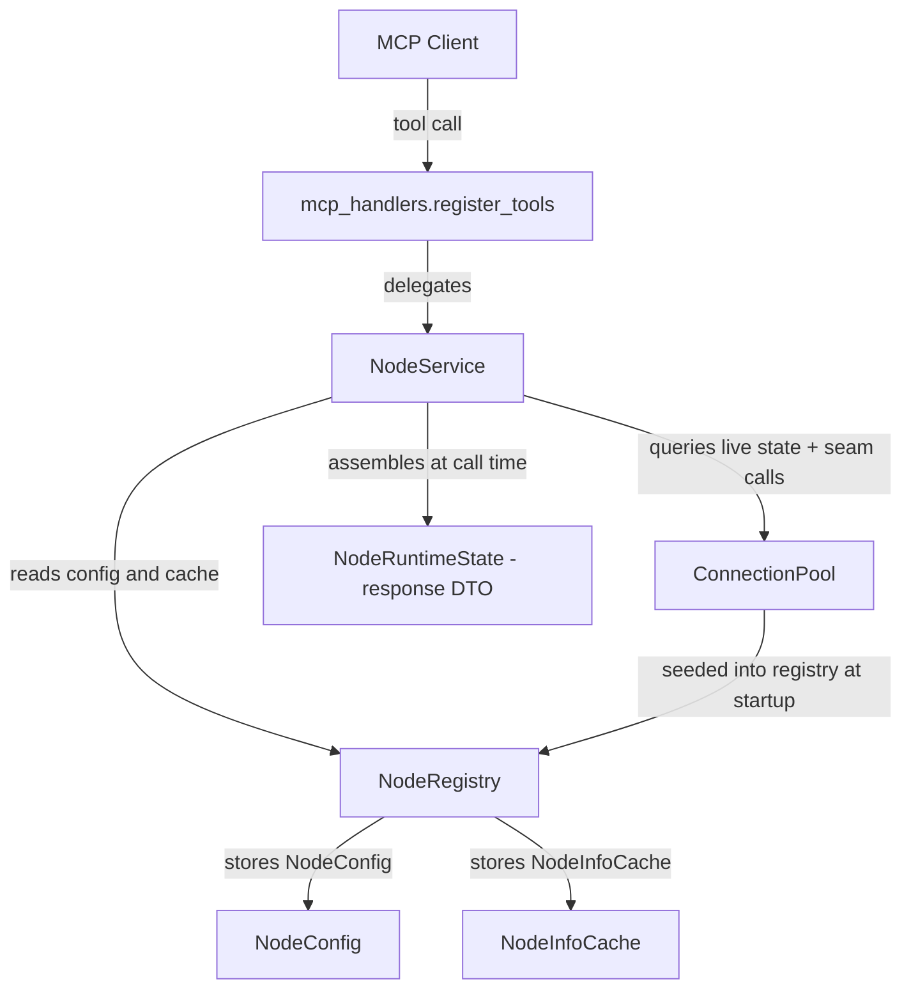

# Node Management API — Structural Slice

## Slice name

**Node Management API structural slice**

## Purpose

Introduce a clean node-oriented MCP API surface. Make the API shape and internal seams solid. Implement only the behavior required for this slice.

---

## API surface

```text
get_status
get_node_info
add_node
remove_node
enable_node
disable_node
```

No other new MCP tools are introduced in this slice.

---

## Terminology

**Node** is the primary noun throughout the entire codebase — public API, internal modules, tests, and documentation.

A node is a configured SSH-reachable execution environment managed by the gateway.

Terms `device`, `edge`, `remote`, and `target` must not appear in new public API, new node modules, new tests, or any documentation touched by this slice.

### Semantic model

```
node       = managed SSH-reachable execution environment (identity + config)
connection = runtime SSH transport/session to a node
pool       = runtime collection of connections and their lifecycle management
```

These three concepts are distinct. Node identity belongs to the node layer. SSH mechanics belong to the connection/pool layer.

### Retirement in this slice

`get_device_info` is **retired**. The "device" noun is prohibited on the public API. The tool is removed from `mcp_handlers.py`. Its platform-info intent is subsumed by `get_node_info`.

### Kept without change

`run_command` and `upload_file` are execution primitives not related to node naming. They are kept as-is. Refactoring execution tools is deferred.

### Transport/infrastructure layer — not renamed

`Connection`, `ConnectionPool`, and `ConnectionConfig` retain their existing internal names. These describe SSH transport mechanics, not managed node identity, and do not directly conflict with the node model.

No renaming of the connection layer is in scope for this slice.

---

## What this slice does and does not implement

### Implemented in this slice

| Behavior | Implemented |
|----------|-------------|
| `get_status` returns gateway status + all configured nodes with enabled/pool state | Yes |
| `get_node_info` returns configured info and cached/pool state per node | Yes (shape + configured info; live discovery stubbed) |
| `add_node` API seam and credential safety contract | Yes (bootstrap returns `bootstrap_not_implemented`; node NOT added to registry) |
| `remove_node` removes node from registry, closes active pool connection | Yes |
| `disable_node` marks node disabled, closes runtime connection, keeps config | Yes |
| `enable_node` marks node enabled, does not eagerly connect | Yes |
| Internal node model: `NodeConfig`, `NodeInfoCache`, `NodeRuntimeState` (DTO only) | Yes |
| `NodeRegistry` in-memory store (NodeConfig + NodeInfoCache only) | Yes |
| `NodeService` service layer | Yes |
| `ConnectionPool` disable/enable/remove seam | Yes |
| `register_tools(mcp, node_service)` handler signature | Yes |
| Pytest coverage for all 6 tools | Yes |
| MCP validation evidence | Yes |

### Not implemented in this slice

| Behavior | Deferred |
|----------|---------|
| Password-based SSH key installation and bootstrap | Deferred |
| `validate=true` live connectivity test in `enable_node` | Deferred |
| `refresh=true` live SSH probing in `get_node_info` | Deferred |
| Full capability discovery | Deferred |
| Execution routing through enabled-check | Deferred |
| Reverse tunnel listener lifecycle | Deferred |
| Dynamic tunnel registration | Deferred |
| Node info persistence | Deferred (in-memory only) |
| Remote key removal on `remove_node` | Deferred |
| Execution history | Deferred |
| Custom REST endpoints | Deferred |
| Broad workflow orchestration | Deferred |

---

## Current state

| File | Relevant content |
|------|-----------------|
| [`agent/mcp_handlers.py`](../agent/mcp_handlers.py) | `register_tools(mcp)` — no pool or node awareness. Tools: `get_status` (returns `{"status":"ok"}`), `get_device_info`, `run_command`, `upload_file` |
| [`agent/connectionpool/pool.py`](../agent/connectionpool/pool.py) | `ConnectionPool` — manages `Connection` objects. Has `query_pool()` and connection close APIs. Background monitor reconnects closed connections |
| [`agent/connectionpool/config_loader.py`](../agent/connectionpool/config_loader.py) | `ConnectionConfig` dataclass, `ConnectionMode` enum |
| [`agent/run_agent.py`](../agent/run_agent.py) | Builds pool, calls `mcp_handlers.register_tools(mcp)` — does not pass pool to handlers |
| [`agent/connectionpool/connection.py`](../agent/connectionpool/connection.py) | `Connection` facade, `ConnectionState` enum |

Problems resolved by this slice:

- Handlers have no access to pool or node state.
- `get_status` returns only `{"status": "ok"}` — no node information.
- No internal node model or registry exists.
- `get_device_info` uses prohibited "device" terminology.
- No node-management tools exist.
- No explicit pool seam for disabling/removing connections safely.

---

## New file structure

```
agent/
  nodes/
    __init__.py
    models.py        ← NodeConfig, NodeInfoCache, NodeRuntimeState (DTO only — never stored)
    registry.py      ← NodeRegistry (in-memory, thread-safe; stores NodeConfig + NodeInfoCache only)
    service.py       ← NodeService (business logic; computes NodeRuntimeState at call time)
  mcp_handlers.py    ← updated: register_tools(mcp, node_service); get_device_info removed
  run_agent.py       ← updated: seed registry, construct NodeService, pass to register_tools

tests/
  agent/
    nodes/
      __init__.py
      test_registry.py      ← registry unit tests
      test_node_service.py  ← NodeService unit tests
    connectionpool/
      test_pool.py          ← extended: pool seam tests added
    test_mcp_node_tools.py
```

---

## ConnectionPool disable/remove/enable seam

### Problem

`ConnectionPool` has a background monitor loop that automatically reconnects closed connections. If `disable_node` or `remove_node` only calls `connection.close()`, the monitor will silently reopen the connection — violating the node API contract.

### Required seam

Add the following three public methods to `ConnectionPool`. The seam must be small. Do not redesign the pool.

```python
pool.disable_connection(name: str) -> None
    # Closes the connection AND marks it as disabled.
    # The monitor loop must skip reconnect for disabled connections.

pool.enable_connection(name: str) -> None
    # Re-enables the connection for monitor management.
    # Does NOT immediately open the connection.

pool.remove_connection(name: str) -> None
    # Closes the connection, removes it from the pool entirely.
    # Prevents any reconnect attempt. Raises KeyError if not found.
```

### Monitor constraint

The pool's background monitor loop must check the disabled/removed state for each connection before attempting any reconnect. A connection that is disabled or has been removed must never be reopened by the monitor.

### NodeService usage

`NodeService` must use these seam methods rather than calling `connection.close()` directly:

- `disable_node` → `pool.disable_connection(name)`
- `remove_node` → `pool.remove_connection(name)`
- `enable_node` → `pool.enable_connection(name)` (marks re-enabled; does not open)

---

## Internal model

### `agent/nodes/models.py`

```python
@dataclass
class NodeConfig:
    name: str
    mode: str           # "direct" | "tunnel"
    enabled: bool
    host: Optional[str]
    port: int
    user: str
    id_file: Optional[str]

@dataclass
class NodeRuntimeState:
    pool_state: str     # "open" | "closed" | "opening" | "broken" | "unknown"
    reachable: bool
    last_seen_at: Optional[str]   # ISO 8601 string or null
    last_error: Optional[str]

@dataclass
class NodeInfoCache:
    facts: dict         # e.g. {"hostname": {"value": "...", "source": "cache", "collected_at": null}}
    collected_at: Optional[str]
```

**`NodeRuntimeState` is a response DTO — it is never stored in the registry.**

`NodeRuntimeState` is assembled at call time from two live sources:
1. Registry: `NodeConfig.enabled`, `NodeConfig.mode`, etc.
2. Pool: current `ConnectionState` queried directly from `ConnectionPool` at call time.

`NodeInfoCache` defaults to `facts={}`, `collected_at=None`.

**`NodeConfig` bridging note:** In this slice, `NodeConfig` fields (`host`, `port`, `user`, `id_file`) are populated directly from the existing `ConnectionConfig` on startup. This is a temporary bridge. The long-term direction is for SSH transport details to move toward OpenSSH config file entries, with `NodeConfig` holding only the node identity and management state. The `id_file` and raw `host`/`port`/`user` fields in `NodeConfig` are acceptable for this slice because they come from the existing config format. They must not be treated as permanent fields of the node identity model.

### `agent/nodes/registry.py` — `NodeRegistry`

- In-memory store: `dict[str, tuple[NodeConfig, NodeInfoCache]]`
- Thread-safe via `threading.Lock`
- **Does not store `NodeRuntimeState`** — runtime state is computed from the live pool at call time.
- Public interface:

```python
class NodeRegistry:
    def add(self, config: NodeConfig) -> None
        # adds with empty NodeInfoCache; raises ValueError if name already exists

    def remove(self, name: str) -> None
        # raises KeyError if not found

    def get(self, name: str) -> tuple[NodeConfig, NodeInfoCache]
        # raises KeyError if not found

    def all(self) -> list[tuple[NodeConfig, NodeInfoCache]]

    def exists(self, name: str) -> bool

    def update_config(self, name: str, config: NodeConfig) -> None

    def update_cache(self, name: str, cache: NodeInfoCache) -> None
```

### `agent/nodes/service.py` — `NodeService`

```python
class NodeService:
    def __init__(self, registry: NodeRegistry, pool: ConnectionPool): ...

    def get_status(self) -> dict: ...
    def get_node_info(self, name: Optional[str], refresh: bool) -> dict: ...
    def add_node(self, name, host, port, user, password, mode) -> dict: ...
    def remove_node(self, name) -> dict: ...
    def enable_node(self, name, validate: bool) -> dict: ...
    def disable_node(self, name) -> dict: ...
```

`NodeService` composes `NodeRuntimeState` at call time by reading `NodeConfig` from the registry and querying `ConnectionPool` directly. It uses the pool seam methods (`disable_connection`, `enable_connection`, `remove_connection`) for all state-changing operations.

**`get_status` composition model:** `get_status` must not copy or cache pool runtime state into the registry. It must compose results at call time: read node config and enabled state from the registry, then read current `ConnectionState` from the matching pool connection (if one exists) to derive `pool_state`. This keeps registry state and runtime pool state as separate sources of truth. Stale copied runtime state is explicitly prohibited.

---

## MCP handler style

All 6 new tools registered in `mcp_handlers.py` must use **explicit typed arguments** — not a generic `params` dict. The existing `get_status`, `get_device_info`, and `run_command` use mixed parameter styles. The new node tools must not inherit this inconsistency.

```python
# Correct — explicit typed arguments
@mcp.tool()
async def disable_node(name: str) -> dict: ...

@mcp.tool()
async def add_node(name: str, host: str, port: int, user: str, password: str, mode: str) -> dict: ...

# Prohibited — generic params dict
@mcp.tool()
async def disable_node(params: dict) -> dict: ...
```

This applies to all 6 tools in this slice: `get_status`, `get_node_info`, `add_node`, `remove_node`, `enable_node`, `disable_node`.

---

## `register_tools` signature change

**Before** (`agent/run_agent.py` + `agent/mcp_handlers.py`):
```python
mcp_handlers.register_tools(mcp)
```

**After**:
```python
# agent/run_agent.py
from agent.nodes.models import NodeConfig, NodeInfoCache
from agent.nodes.registry import NodeRegistry
from agent.nodes.service import NodeService

registry = NodeRegistry()
for conn in pool.connections:
    cfg = NodeConfig(
        name=conn.name,
        mode=conn.mode.value,
        enabled=True,
        host=conn.host,
        port=conn.port,
        user=conn.user,
        id_file=conn.id_file,
    )
    registry.add(cfg)

node_service = NodeService(registry=registry, pool=pool)
mcp_handlers.register_tools(mcp, node_service)
```

```python
# agent/mcp_handlers.py
def register_tools(mcp: FastMCP, node_service: NodeService): ...
```

---

## API contracts

### `get_status`

- Must not perform live SSH access.
- Must not fail if no nodes are configured.
- Reads from registry and current pool connection states only.
- Pool state is derived by inspecting `pool.connections` for matching names.

Response shape:

```json
{
  "status": "ok",
  "nodes": [
    {
      "name": "lab-pi-01",
      "mode": "direct",
      "enabled": true,
      "configured": true,
      "pool_state": "open",
      "reachable": true,
      "last_seen_at": null,
      "last_error": null,
      "cached_info_available": false
    }
  ]
}
```

Empty case: `{"status": "ok", "nodes": []}`.

### `get_node_info`

Input: `{ "name": "lab-pi-01", "refresh": false }`

Rules:
- `name` is optional. Omit to return all configured nodes.
- `refresh` defaults to `false`.
- `refresh=false`: returns configured info, cached facts, and current pool state. No live SSH.
- `refresh=true`: stubbed in this slice — returns same as `refresh=false` with a note that live refresh is not yet implemented.
- Unknown `name`: returns `{"error": "node not found", "name": "..."}`.

Response shape:

```json
{
  "nodes": [
    {
      "name": "lab-pi-01",
      "enabled": true,
      "pool_state": "open",
      "info": {}
    }
  ]
}
```

`info` contains cached facts if any exist, otherwise `{}`. The shape of individual facts follows `{"value": ..., "source": "cache", "collected_at": null}`. In this slice, facts will be empty for newly added nodes.

### `add_node`

Input: `{ "name", "host", "port", "user", "password", "mode" }`

Credential safety contract (non-negotiable):
- `password` is a function parameter only.
- It must **not** be assigned to any variable that persists beyond the call frame.
- It must **not** appear in any log statement.
- It must **not** be included in the return value.
- It must **not** be included in test snapshots or assertions on content.
- It must **not** be stored in config, cache, registry, or any file.

Bootstrap behavior:
- Key installation and passwordless validation are **not implemented** in this slice.
- `add_node` returns `bootstrap_not_implemented` and **does not add the node to the registry**.
- No partial registration without validated passwordless access. There is no acceptable path in this slice where the node ends up in the registry without bootstrap completing.

Response (bootstrap not implemented):

```json
{
  "status": "bootstrap_not_implemented",
  "name": "lab-pi-01",
  "reason": "password-based bootstrap is not implemented in this slice"
}
```

### `remove_node`

Input: `{ "name": "lab-pi-01" }`

Rules:
- Must not require the node to be reachable.
- Calls `pool.remove_connection(name)` to close and permanently remove the pool entry.
- Removes node from registry.
- Unknown name: returns `{"error": "node not found", "name": "..."}`.

Response:

```json
{ "status": "removed", "name": "lab-pi-01" }
```

### `enable_node`

Input: `{ "name": "lab-pi-01", "validate": false }`

Rules:
- Sets `enabled=True` in registry config.
- Calls `pool.enable_connection(name)` to re-enable monitor management.
- Does not open an SSH connection.
- `validate=true` is stubbed — acknowledged but not acted on in this slice.
- Unknown name: returns `{"error": "node not found", "name": "..."}`.

Response:

```json
{ "status": "enabled", "name": "lab-pi-01" }
```

### `disable_node`

Input: `{ "name": "lab-pi-01" }`

Rules:
- Sets `enabled=False` in registry config.
- Calls `pool.disable_connection(name)` to close and prevent monitor from reopening.
- Node remains in registry — still visible in `get_status`.
- Cached info is preserved.
- Unknown name: returns `{"error": "node not found", "name": "..."}`.

Response:

```json
{ "status": "disabled", "name": "lab-pi-01" }
```

---

## Data flow



**Note:** `NodeRuntimeState` is assembled at call time from `NodeConfig` (registry) + live pool state. It is never stored in the registry.

---

## Testing plan

### `tests/agent/nodes/test_registry.py`

Unit tests for `NodeRegistry`. All tests use a real in-memory `NodeRegistry` instance.

| Test | Validates |
|------|-----------|
| `test_add_and_get` | `add()` then `get()` returns the same `NodeConfig` and empty `NodeInfoCache` |
| `test_add_duplicate_raises` | `add()` with an existing name raises `ValueError` |
| `test_remove_existing` | `remove()` removes the node; subsequent `get()` raises `KeyError` |
| `test_remove_unknown_raises` | `remove()` with unknown name raises `KeyError` |
| `test_exists_true_and_false` | `exists()` returns `True` when present, `False` when not |
| `test_all_returns_all_entries` | `all()` returns all `(NodeConfig, NodeInfoCache)` tuples |
| `test_update_config` | `update_config()` replaces the stored `NodeConfig` |
| `test_update_cache` | `update_cache()` replaces the stored `NodeInfoCache` |
| `test_registry_does_not_store_runtime_state` | `get()` return type is `tuple[NodeConfig, NodeInfoCache]` (two elements only) |

### `tests/agent/nodes/test_node_service.py`

Unit tests for `NodeService`. All tests use a real `NodeRegistry` instance and a mocked `ConnectionPool`. No live SSH.

| Test | Validates |
|------|-----------|
| `test_get_status_empty_registry` | Returns `{"status": "ok", "nodes": []}` |
| `test_get_status_includes_node_fields` | Returns `enabled`, `pool_state`, `configured`, `cached_info_available` per node |
| `test_get_status_pool_state_from_pool_not_registry` | `pool_state` reflects live pool query, not any stored value |
| `test_add_node_returns_bootstrap_not_implemented` | Status is `bootstrap_not_implemented`, reason is present |
| `test_add_node_does_not_add_to_registry` | Registry unchanged after `add_node` call |
| `test_add_node_result_contains_no_password` | Return value dict has no `password` key |
| `test_add_node_password_not_in_logs` | Password does not appear in captured log output (uses `caplog`) |
| `test_add_node_password_not_in_registry` | Registry entries contain no password field after any call |
| `test_remove_node_removes_from_status` | Node absent from `get_status` after removal |
| `test_remove_node_calls_pool_remove_connection` | `pool.remove_connection(name)` called, not `close()` |
| `test_remove_node_unknown_returns_error` | Error shape returned for unknown name |
| `test_disable_node_marks_disabled` | `enabled=False` in `get_status`, node still present |
| `test_disable_node_calls_pool_disable_connection` | `pool.disable_connection(name)` called, not `close()` |
| `test_enable_node_marks_enabled` | `enabled=True` in `get_status` |
| `test_enable_node_calls_pool_enable_connection` | `pool.enable_connection(name)` called |
| `test_get_node_info_all_nodes` | Returns list of all configured nodes |
| `test_get_node_info_single_node` | Returns only the named node |
| `test_get_node_info_unknown_node` | Returns `{"error": "node not found", ...}` |
| `test_get_node_info_refresh_false_no_ssh` | No SSH interaction on `refresh=false` |

### `tests/agent/connectionpool/test_pool.py` (additions)

New tests added to the existing pool test file to cover the seam:

| Test | Validates |
|------|-----------|
| `test_disable_connection_closes_and_prevents_reconnect` | Monitor does not reopen a disabled connection |
| `test_enable_connection_allows_monitor_to_reconnect` | Monitor may reconnect after `enable_connection()` |
| `test_remove_connection_removes_from_pool` | Connection absent from pool after `remove_connection()` |
| `test_remove_connection_unknown_raises` | `remove_connection()` raises `KeyError` for unknown name |
| `test_monitor_skips_disabled_connection` | Monitor loop iteration leaves disabled connection closed |

### `tests/agent/test_mcp_node_tools.py`

Handler-level tests. Tests verify tool registration and basic response contracts. All use mocked `NodeService`.

| Test | Validates |
|------|-----------|
| `test_tool_registration_includes_all_six_node_tools` | All 6 tool names registered |
| `test_get_device_info_not_registered` | `get_device_info` is absent from registered tools |
| `test_get_status_response_has_status_and_nodes` | Response has `status` and `nodes` keys |
| `test_disable_node_keeps_node_in_status` | Disabled node still present in `get_status` result |
| `test_enable_node_returns_enabled_shape` | `{"status": "enabled", "name": ...}` |
| `test_remove_node_returns_removed_shape` | `{"status": "removed", "name": ...}` |
| `test_add_node_returns_bootstrap_not_implemented` | Status is `bootstrap_not_implemented` |
| `test_add_node_result_has_no_password_field` | No password in return value |
| `test_get_node_info_all_returns_nodes_list` | Response has `nodes` list |
| `test_get_node_info_single_returns_one_node` | Response has one-node `nodes` list |
| `test_get_node_info_unknown_returns_error` | Error response for unknown name |

---

## MCP validation

### Standard smoke test (read-only)

These two tools are part of the standard gateway smoke test in `docs/MCP_VALIDATION_GUIDE.md`:

```
get_status
get_node_info
```

The smoke test must remain read-only. It must not invoke mutating tools.

### Task-focused validation for this slice

The following tools are validated as part of this slice's evidence block — separate from the smoke test, recorded in the task completion block:

```
add_node
remove_node
enable_node
disable_node
```

For mutating tools, use safe synthetic test data. Validate request/response shape and state transitions only — no real SSH credentials, no real network targets.

**Document this split clearly in `docs/MCP_VALIDATION_GUIDE.md`:** the smoke test section remains `get_status` + `get_node_info` only; a separate "Task validation" section documents how to validate mutating tools for this slice.

---

## Documentation updates

### [`docs/SECURITY.md`](../docs/SECURITY.md)

Add a new section **Assisted Node Onboarding** covering:

- `add_node` may accept a temporary password for assisted onboarding.
- Temporary credentials are used only to install the gateway public key and verify passwordless SSH.
- Credentials must never be stored, logged, echoed, cached, or included in responses.
- Password-based bootstrap is not yet implemented. The current implementation returns an explicit `bootstrap_not_implemented` result and does not add the node to the registry.
- Documentation must clearly distinguish implemented behavior from intended onboarding behavior.

### [`docs/MCP_VALIDATION_GUIDE.md`](../docs/MCP_VALIDATION_GUIDE.md)

- Update smoke test to include `get_status` and `get_node_info` as the read-only node tools.
- Remove `get_device_info` from the smoke test (tool is retired).
- Add a separate **Task validation** section documenting invocation of all 6 node tools including mutating ones, with safe synthetic test data.
- Document the smoke test vs. task validation split explicitly.

### [`docs/ARCHITECTURE.md`](../docs/ARCHITECTURE.md)

- Update "Current Implementation Boundary" section to mention the node-oriented MCP API surface, `NodeRegistry`, `NodeService`, and the `ConnectionPool` seam.
- Keep all existing content.

No large new documents are introduced.

---

## Development and testing loop

This slice uses TDD and live MCP validation together. MCP validation is not a final checkbox — use it early once structural tool registration exists, because the point of this slice is to establish the product-facing API surface.

### Iteration loop

```
1. Define expected contract for the next API behavior.
2. Add pytest coverage for that deterministic behavior first (TDD).
3. Implement the minimal internal model and handler wiring to satisfy it.
4. Run targeted pytest after each behavior is introduced.
5. Once basic tool registration exists, start the gateway and validate exposed tools through Roo MCP.
6. Use MCP findings to harden pytest where the product surface behaves differently than expected.
7. Repeat until pytest and live MCP evidence agree on all 6 tools.
```

### Pytest coverage requirements (first-class deliverable)

At minimum, pytest must cover:

| Behavior | Test file |
|----------|-----------|
| Registry stores NodeConfig + NodeInfoCache only (not NodeRuntimeState) | `test_registry.py` |
| Tool registration for all 6 APIs | `test_mcp_node_tools.py` |
| `get_device_info` absent from registration | `test_mcp_node_tools.py` |
| `get_status` response shape | both |
| `get_status` pool_state from live pool (not registry) | `test_node_service.py` |
| `get_node_info` response shape | both |
| Unknown node handling | `test_node_service.py` |
| `enable_node` / `disable_node` state transitions | `test_node_service.py` |
| `disable_node` uses `pool.disable_connection()` not `close()` | `test_node_service.py` |
| `remove_node` uses `pool.remove_connection()` not `close()` | `test_node_service.py` |
| `remove_node` removes node from status | `test_node_service.py` |
| `add_node` returns `bootstrap_not_implemented` | both |
| `add_node` does NOT add node to registry | `test_node_service.py` |
| `add_node` password not stored, not logged (caplog), not echoed, not in return value | `test_node_service.py` |
| Pool monitor skips disabled connections | `test_pool.py` |

For mutating tools, tests use safe synthetic test data and validate request/response shape and state transitions only — no real SSH credentials, no real network targets.

### MCP validation gate

This slice changes MCP tool registration, tool names, and response shapes. The MCP validation gate from [`docs/MCP_VALIDATION_GUIDE.md`](../docs/MCP_VALIDATION_GUIDE.md) applies.

After pytest passes:

1. Start gateway: `python3 app.py`
2. Endpoint: `http://localhost:8000/mcp`
3. Confirm all 6 node tools are visible and `get_device_info` is absent.
4. **Smoke test** (read-only): invoke `get_status`, `get_node_info`.
5. **Task-focused validation**: invoke `add_node`, `disable_node`, `enable_node`, `remove_node` with safe synthetic test data.
6. Record the standard evidence block per the validation guide.

---

## Delivery checklist

- [ ] `agent/nodes/__init__.py`
- [ ] `agent/nodes/models.py` — `NodeConfig`, `NodeInfoCache`, `NodeRuntimeState` (DTO only, never stored); bridging note
- [ ] `agent/nodes/registry.py` — `NodeRegistry` storing `NodeConfig` + `NodeInfoCache` only
- [ ] `agent/nodes/service.py` — `NodeService` with live pool-state composition; uses pool seam methods
- [ ] `agent/connectionpool/pool.py` — `disable_connection`, `enable_connection`, `remove_connection` seam; monitor respects state
- [ ] `agent/mcp_handlers.py` — `register_tools(mcp, node_service)`, 6 node tools with explicit typed arguments, `get_device_info` removed
- [ ] `agent/run_agent.py` — seed registry from pool, construct `NodeService`, pass to `register_tools`
- [ ] `tests/agent/nodes/__init__.py`
- [ ] `tests/agent/nodes/test_registry.py` — registry unit tests
- [ ] `tests/agent/nodes/test_node_service.py` — NodeService unit tests including caplog password safety tests
- [ ] `tests/agent/connectionpool/test_pool.py` — pool seam tests added
- [ ] `tests/agent/test_mcp_node_tools.py`
- [ ] `docs/SECURITY.md` — assisted onboarding credential section
- [ ] `docs/MCP_VALIDATION_GUIDE.md` — smoke test read-only (get_status + get_node_info); separate task-focused validation section
- [ ] `docs/ARCHITECTURE.md` — node API surface, semantic model, pool seam in current boundary
- [ ] All existing tests still pass
- [ ] All new tests pass
- [ ] MCP validation evidence recorded (all 6 tools, state transitions, `add_node` credential boundary)
