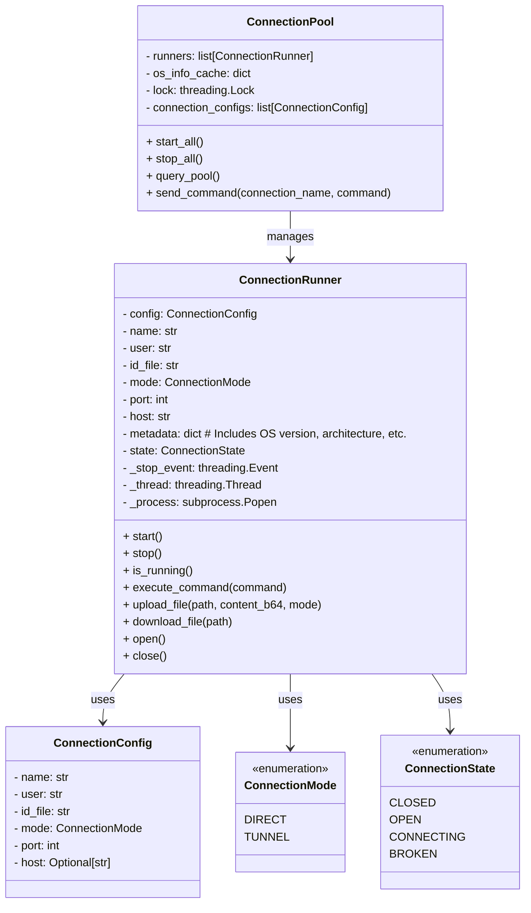

# Refactoring Plan for MCP Agent

## Overview

This plan outlines the refactoring and restructuring of the MCP Agent codebase to improve API design and functionality. The changes aim to make the API cleaner, more intuitive, and easier to maintain.

---

## Objectives

1. **Move Configuration Loading and Parsing**:
   - Move the configuration loading logic from `agent/run_agent.py` to `agent/connectionpool/config_loader.py`.
   - Move the parsing logic from `agent/connectionpool/pool.py` to `agent/connectionpool/config_loader.py`.

2. **Enums for Connection Mode and State**:
   - Introduce enums for connection mode and connection state in `agent/connectionpool/connection.py`.
   - Connection states will include: `CLOSED`, `OPEN`, `CONNECTING`, `BROKEN`.

3. **Refactor Connection Class**:
   - Add connection state and metadata (e.g., OS version, architecture) to `agent/connectionpool/connection.py`.
   - Move the `execute_command`, `upload_file`, and `download_file` functions from `agent/file_utils.py` to `agent/connectionpool/connection.py`.
   - Add `open` and `close` methods to the connection class.

4. **API Design Guidelines**:
   - Ensure pool-level operations (e.g., starting, stopping, connection enumeration) are handled by the pool class.
   - Ensure connection-level operations (e.g., interacting with connected systems) are handled by the connection class.

5. **Documentation**:
   - Add clear and concise documentation to all classes and methods to help developers understand their purpose and usage.

6. **Update `run_agent.py`**:
   - Update `agent/run_agent.py` to call the new configuration loader function and use the refactored pool and connection classes.

---

## Updated Architecture Diagram

---

## Implementation Steps

### 1. Refactor `config_loader.py`
- Add `load_and_parse_connections` function.
- Move parsing logic from `pool.py` to `config_loader.py`.

### 2. Update `pool.py`
- Remove parsing logic.
- Update constructor to accept parsed configurations.

### 3. Refactor `connection.py`
- Add enums for `ConnectionMode` and `ConnectionState`.
- Add metadata attributes (e.g., OS version, architecture) and methods (`open`, `close`, etc.).
- Move functions from `file_utils.py` to `connection.py`.

### 4. Update `run_agent.py`
- Replace direct configuration loading with a call to `load_and_parse_connections`.
- Use the refactored pool and connection classes.

### 5. Add Documentation
- Add docstrings to all classes and methods.

---

## Connection Metadata Details

The connection metadata will include:
- **OS Version**: The version of the operating system running on the connected system.
- **Architecture**: The system architecture (e.g., x86_64, ARM).
- **Additional Info**: Any other relevant details that can be gathered during connection initialization.

---

## Next Steps

This plan is ready for implementation. Let me know if there are any further changes or additions required.